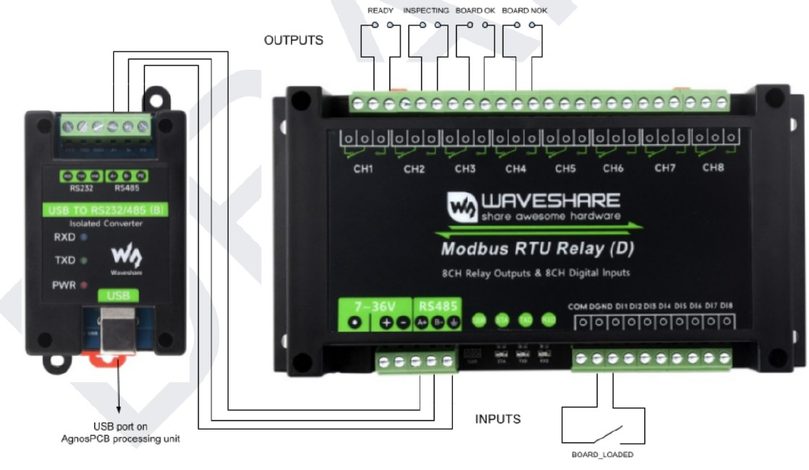
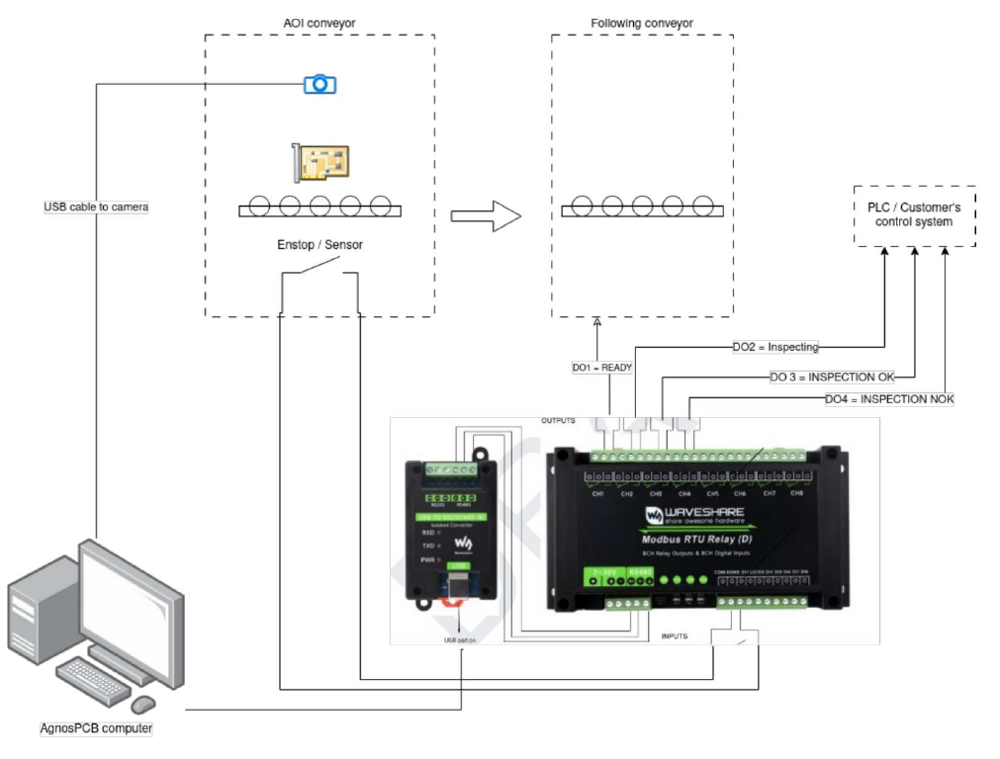
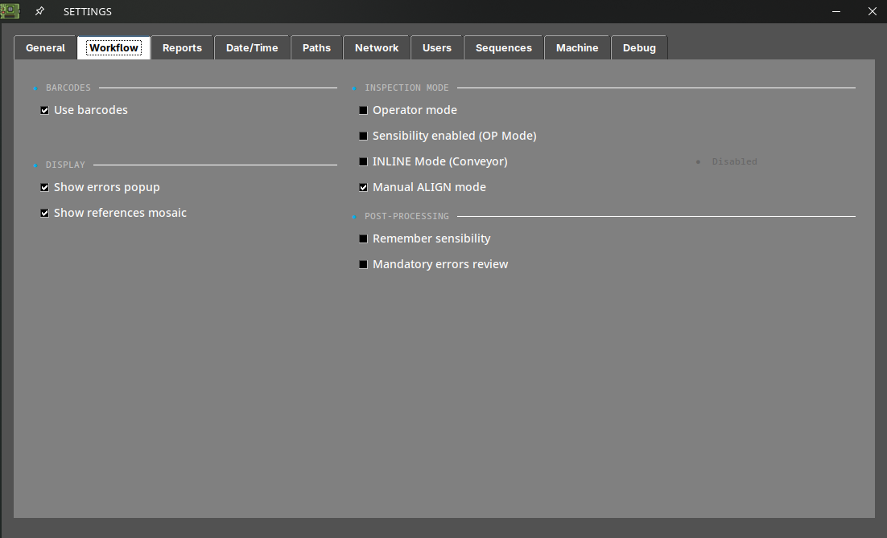

# Intégration en ligne de production (mode INLINE)

Ce guide explique comment intégrer l'**AgnosPCB AI 4050** dans une ligne de
production automatisée, afin que l'AOI reçoive les cartes depuis un convoyeur,
les inspecte sans intervention de l'opérateur et renvoie un résultat PASS/FAIL
au contrôleur de ligne.

L'intégration comporte deux parties :

1. Le **module MODBUS**, qui relie l'AOI au convoyeur et au contrôleur de ligne (automate, PLC).
2. Le **mode INLINE** du logiciel d'inspection, qui pilote le fonctionnement autonome.

!!! warning "À lire avant de commencer"

    L'intégration en ligne implique des travaux électriques à la fois sur
    l'AOI et sur le contrôleur du convoyeur. Tout le câblage doit être
    effectué avec **les deux systèmes hors tension**, et par un personnel
    qualifié pour intervenir sur l'armoire de commande de la ligne.

---

## Avant de commencer

Vérifiez que vous disposez des éléments suivants :

- Une unité **AI 4050** déjà déballée, assemblée et fonctionnant en mode
  autonome. Si vous n'en êtes pas encore là, terminez d'abord le
  [guide de déballage](../getting_started/Unboxing.md) et le [guide de connexion](../getting_started/Connection_guide.md).
- Une image de **RÉFÉRENCE** déjà capturée et validée pour chaque produit que
  la ligne traitera. Le mode INLINE inspecte par rapport à des RÉFÉRENCES
  existantes : il ne peut pas en créer.
- Le **module MODBUS** fourni par AgnosPCB pour votre unité.
- L'accès à l'environnement de programmation du contrôleur de ligne (PLC).

!!! note "Licences"

    Le mode INLINE et la sortie de rapport JSON sont des fonctionnalités
    soumises à licence. Confirmez auprès de
    [support@agnospcb.com](mailto:support@agnospcb.com) que le profil de
    votre compte les a activées avant la mise en service de la ligne — sinon,
    les options resteront sans effet.

---

## 1. Installation du module MODBUS

<!-- TODO (ingénierie AgnosPCB) : l'affectation des E/S et le raccordement à
     l'unité de traitement sont documentés à partir des schémas de câblage.
     Il manque encore :
     - L'emplacement de montage du module (rail DIN dans l'armoire ? boîtier externe ?)
     - Quelle alimentation alimente l'entrée 7~36 V, et sa puissance
     - Le type de câble et la longueur maximale pour la liaison RS-485 et pour les E/S
     - Si les contacts relais sont utilisés en NO ou en NF, et leur charge nominale
     - Le détail du câblage côté automate -->

{.center}

Le module fournit **8 sorties relais** et **8 entrées numériques**, dont
l'intégration utilise une entrée et quatre sorties. Il se connecte à un
**port USB de l'unité de traitement AgnosPCB** via le convertisseur isolé USB
vers RS232/485, comme indiqué sur le schéma ci-dessus.

### Entrées

L'entrée doit être raccordée à un **capteur de fin de course**, ou à tout
autre capteur détectant que la PCBA est en place et prête à être inspectée.

| Entrée | Signal | Fonction |
|---|---|---|
| **DI1** | `BOARD_LOADED` | Déclenche une inspection, à condition que la plateforme d'inspection soit prête. |

### Sorties

Les sorties communiquent l'état de l'inspection au reste de la ligne
d'assemblage : au convoyeur suivant et à l'automate ou au système de contrôle
de la ligne.

| Sortie | Borne | Signal | Active quand |
|---|---|---|---|
| **DO1** | CH1 | `READY` | La plateforme d'inspection est prête à démarrer une inspection. |
| **DO2** | CH2 | `INSPECTING` | La plateforme d'inspection est en train d'effectuer une inspection. |
| **DO3** | CH3 | `BOARD OK` | L'inspection est terminée et la carte inspectée est conforme. |
| **DO4** | CH4 | `BOARD NOK` | L'inspection est terminée et un défaut a été détecté sur la carte. |

!!! note "Quand READY est inactive"

    **DO1** n'est pas active pendant l'initialisation du système, tant qu'une
    tâche de traitement est en cours, ou lorsque l'application n'est pas dans
    la fenêtre principale — par exemple lorsque le menu des paramètres ou le
    mosaïque de références est ouvert.

### Connexion générale

Le schéma suivant montre comment tous les éléments concernés sont connectés
dans une installation type :

{.center}

Quatre groupes d'équipements participent à l'intégration :

- Le **convoyeur de l'AOI**, qui amène la carte dans la zone d'inspection et porte la caméra et le capteur de position.
- L'**ordinateur AgnosPCB**, qui exécute le logiciel d'inspection.
- Le **module MODBUS** avec son convertisseur USB vers RS-485, qui fait le lien entre le logiciel et les signaux électriques de la ligne.
- Les **équipements de la ligne** : le convoyeur qui suit l'AOI, et l'automate ou le système de contrôle du client.

Les connexions entre eux sont les suivantes :

| De | Vers | Connexion | Fonction |
|---|---|---|---|
| Caméra du convoyeur de l'AOI | Ordinateur AgnosPCB | USB | Capture les images de la carte. |
| Ordinateur AgnosPCB | Convertisseur USB vers RS232/485 | USB | Achemine la communication MODBUS hors de l'ordinateur. |
| Convertisseur USB vers RS232/485 | Module MODBUS | RS-485 (**A+** / **B−**) | Relie le convertisseur au module relais. |
| Capteur de fin de course du convoyeur de l'AOI | Entrée **DI1** du module MODBUS | Entrée numérique | Signale que la carte est en place, ce qui déclenche l'inspection. |
| Sortie **DO1** du module MODBUS | Convoyeur suivant | Contact relais | Indique au convoyeur suivant que l'AOI est prête à recevoir une carte. |
| Sorties **DO2**, **DO3** et **DO4** du module MODBUS | Automate / système de contrôle du client | Contacts relais | Rendent compte de la progression et du résultat de l'inspection. |

!!! note "Alimentation"

    Outre ces connexions, le module MODBUS doit être alimenté via son entrée
    **7~36 V**, qui n'est pas représentée sur le schéma.

---

## 2. Configuration du logiciel d'inspection

Une fois le module installé et la communication établie, préparez le logiciel
pour un fonctionnement autonome. Toutes les options ci-dessous se trouvent
dans la fenêtre **Settings** ; consultez le
[menu des paramètres](../how_to/Settings_menu.md) pour la référence complète.

### 2.1 Activer le mode INLINE

Ouvrez **Settings → Workflow** et activez **INLINE Mode (Conveyor)**.

{.center}

Cela fait passer le logiciel du flux de travail manuel, piloté au clavier, au
flux de travail piloté par API utilisé sur une ligne : l'inspection est
déclenchée par le contrôleur de ligne plutôt que par l'opérateur appuyant sur
**S**.

### 2.2 Paramètres complémentaires recommandés

Ces options ne sont pas obligatoires, mais sur une ligne autonome, elles font
la différence entre une intégration propre et un convoyeur bloqué :

| Paramètre | Emplacement | Valeur recommandée | Pourquoi |
|---|---|---|---|
| **Operator mode** | Workflow | Activé | Masque la capture de référence et empêche un opérateur de modifier la RÉFÉRENCE ou la sensibilité en cours de poste. Protégez-le avec un mot de passe des paramètres (voir le [menu des paramètres](../how_to/Settings_menu.md)). |
| **Mandatory errors review** | Workflow | **Désactivé** | Si cette option est activée, le logiciel attend qu'une personne examine chaque défaut avant d'autoriser l'inspection suivante — cela bloquera la ligne. |
| **Show errors popup** | Workflow | Désactivé | Empêche une boîte de dialogue modale d'attendre une saisie pendant le fonctionnement automatique. |
| **Show references mosaic** | Workflow | Désactivé | Évite une fenêtre contextuelle après la capture d'image. |
| **Auto report OK / NOK** | Reports | Les deux activés | Génère le PDF de chaque carte sans action de l'opérateur, de sorte que la ligne produit un enregistrement complet de traçabilité. |
| **Create JSON report** | Reports | Activé | Résultat lisible par machine pour votre MES/SCADA. Nécessite une licence. |
| **Use barcodes** | Workflow | Activé | Permet à l'AOI de charger automatiquement la bonne RÉFÉRENCE à partir du code-barres de la carte, afin que les lignes multi-produits ne nécessitent pas de changement de produit manuel. Nécessite une licence. Voir [lecteur de code-barres](../features/Barcode_reader.md). |

!!! note "Note"

    Avec **Auto report** activé, chaque défaut est écrit dans le PDF avec
    l'étiquette « unknown », car aucun opérateur ne les classe. C'est normal
    sur une ligne : la classification est effectuée plus tard, hors ligne, à
    partir des rapports enregistrés.

### 2.3 Où les résultats sont écrits

Les sorties d'inspection sont écrites dans le dossier **PCB_OUT**,
configurable dans **Settings → Paths**.

Pour que votre MES ou un lecteur réseau les récupère automatiquement, activez
les partages dans **Settings → Network** : **Share PCB_OUT**,
**Share REFERENCES** et **Share REPORTS** exposent ces dossiers sur le réseau,
et chacun affiche son chemin réseau une fois activé. Pour les unités OFFLINE
nécessitant une interface réseau spécifique, consultez l'article
[configuration de l'interface réseau](../maintenance/network_configuration.md).

---

## 3. Liste de vérification de mise en service

Avant de remettre la cellule à la production, vérifiez les points suivants
dans l'ordre. Effectuez les premiers essais avec le convoyeur en mode
manuel/jog.

1. **L'inspection autonome fonctionne.** Le mode INLINE étant encore
   désactivé, effectuez une inspection normale au clavier et confirmez que le
   résultat est correct. Si l'AOI n'inspecte pas correctement à la main, elle
   n'inspectera pas correctement sur la ligne.
2. **Les RÉFÉRENCES sont chargées** pour chaque produit que la ligne traitera,
   et chacune a été validée sur une carte connue comme bonne. Voir les
   [conseils](../help/Tips.md).
3. **La lecture de codes-barres est fiable**, si vous l'utilisez pour le
   changement de produit. Testez-la sur plusieurs cartes, y compris les
   étiquettes les moins bien imprimées que vous ayez.
4. **Le positionnement de la carte est reproductible.** Le convoyeur doit
   présenter la carte dans la zone d'inspection à une position constante —
   l'AOI signale **WARNING / ROTATED** ou **WARNING / SHIFTED** lorsque la
   carte s'écarte significativement de la RÉFÉRENCE. Surveillez ces
   avertissements lors des premiers cycles et corrigez la butée mécanique ou
   le montage de la carte avant de passer en production.
5. **Les signaux MODBUS sont actifs** — l'entrée **DI1** déclenche une
   inspection, et les sorties **DO1** à **DO4** changent d'état comme prévu
   côté ligne.
6. **Un cycle complet s'exécute de bout en bout**, avec une carte connue comme
   bonne et une carte connue comme défectueuse, et le contrôleur de ligne
   reçoit à chaque fois le bon résultat PASS et FAIL.
7. **Les rapports sont bien écrits** dans PCB_OUT et accessibles depuis votre
   MES.
8. **Le comportement en cas de défaillance est correct.** Arrêtez le logiciel
   de l'AOI en cours de cycle et confirmez que le contrôleur de ligne détecte
   la perte et cesse d'alimenter des cartes plutôt que de les laisser passer
   sans inspection.

---

## Dépannage

| Symptôme | Vérification |
|---|---|
| La ligne s'arrête après la première carte défectueuse | **Mandatory errors review** est activé. Désactivez-le dans Settings → Workflow. |
| Une boîte de dialogue attend une saisie en cours de cycle | Désactivez **Show errors popup** et **Show references mosaic** dans Settings → Workflow. |
| Chaque carte échoue sur un nouveau produit | La RÉFÉRENCE chargée ne correspond pas au produit. Vérifiez la lecture du code-barres, ou la RÉFÉRENCE sélectionnée pour le lot. |
| **WARNING / ROTATED** ou **WARNING / SHIFTED** sur la plupart des cartes | Le convoyeur ne présente pas les cartes dans une position reproductible. Corrigez la butée mécanique ; l'AOI compare par rapport à la position de la RÉFÉRENCE. |
| **WARNING / NO CROP** | L'autocrop n'a pas trouvé le bord de la carte et l'image complète a été comparée. Recapturez la RÉFÉRENCE, ou définissez manuellement la zone de recadrage sur l'image de référence. |
| L'AOI cesse d'inspecter et affiche `Engine [ OFFLINE ]` | Unités ONLINE uniquement : la connexion internet ou le compte est en panne. Voir le [dépannage](../maintenance/Troubleshooting.md). |
| Crédits épuisés en cours de poste | Unités ONLINE uniquement : un avertissement apparaît en dessous de 10 crédits. Contactez [support@agnospcb.com](mailto:support@agnospcb.com). |

Pour tout ce qui n'est pas couvert ici, contactez
[support@agnospcb.com](mailto:support@agnospcb.com).
