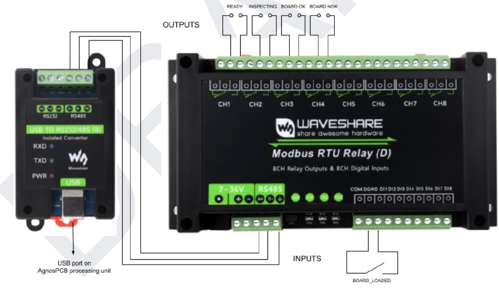
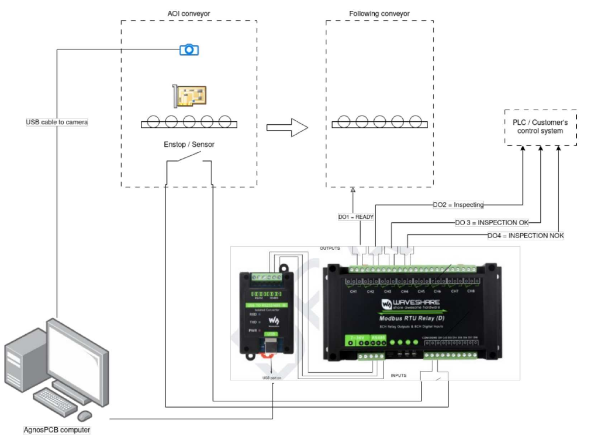

# **Conveyor integration (INLINE mode)**

This guide explains how to integrate the **AgnosPCB AI 4050** into an automated
production line, so the AOI receives boards from a conveyor, inspects them without
operator intervention and returns a PASS/FAIL result to the line controller.

The integration has two parts:

1. The **MODBUS module**, which connects the AOI to the conveyor and to the line controller (PLC).
2. The **INLINE mode** of the inspection software, which drives the unattended workflow.

!!! warning "Read before starting"

    Line integration involves electrical work on both the AOI and the conveyor
    controller. All wiring must be done with **both systems powered off** and by
    personnel qualified to work on the line control cabinet.

---

## Before you begin

Check that you have the following:

- An **AI 4050** unit already unboxed, assembled and working in standalone mode.
  If you have not reached that point yet, complete the
  [unboxing guide](Unboxing.md) and the [connection guide](Connection_guide.md) first.
- A **REFERENCE** image already captured and validated for every product the line
  will run. INLINE mode inspects against existing REFERENCES — it cannot create them.
- The **MODBUS module** supplied by AgnosPCB for your unit.
- Access to the line controller (PLC) programming environment.

!!! note "Licensing"

    INLINE mode and the JSON report output are licensed features. Confirm with
    [support@agnospcb.com](mailto:support@agnospcb.com) that your account profile has
    them enabled before commissioning the line — the options will not take effect
    otherwise.

---

## 1. Installing the MODBUS module

<!-- TODO (AgnosPCB engineering): the I/O assignment and the connection to the
     processing unit are documented from the wiring diagrams. Still missing:
     - Where the module mounts (DIN rail inside the cabinet? external enclosure?)
     - Which power supply feeds the 7~36 V input, and its rating
     - Cable type and maximum run length for the RS-485 link and for the I/O
     - Whether the relay contacts are used as NO or NC, and their rated load
     - PLC-side wiring detail -->

The module provides **8 relay outputs** and **8 digital inputs**, of which the integration uses one input and four outputs. It connects to a **USB port of the AgnosPCB processing unit** through the isolated USB to RS232/485 converter, as shown in the diagram above.

### Inputs

The input has to be connected to an **endstop switch**, or to any sensor that detects that the PCBA is in place and ready to be inspected.

| Input | Signal | Function |
|---|---|---|
| **DI1** | `BOARD_LOADED` | Triggers an inspection, provided that the inspection platform is ready. |

### Outputs

The outputs communicate the inspection status to the rest of the assembly line: to the next conveyor and to the PLC or control system of the line.

| Output | Terminal | Signal | Active when |
|---|---|---|---|
| **DO1** | CH1 | `READY` | The inspection platform is ready to start an inspection. |
| **DO2** | CH2 | `INSPECTING` | The inspection platform is performing an inspection. |
| **DO3** | CH3 | `BOARD OK` | The inspection has completed and the inspected board is OK. |
| **DO4** | CH4 | `BOARD NOK` | The inspection has completed and a fault has been detected on the board. |

!!! note "When READY is off"

    **DO1** is not active during the initialization of the system, while a processing task is ongoing, or when the application is not in the main window — for example while the settings menu or the reference mosaic is open.

### General connection

The following diagram shows how all the elements involved are connected in a typical installation:

{.center}

Four groups of equipment take part in the integration:

- The **AOI conveyor**, which carries the board into the inspection area and holds the camera and the position sensor.
- The **AgnosPCB computer**, which runs the inspection software.
- The **MODBUS module** together with its USB to RS-485 converter, which translates between the software and the electrical signals of the line.
- The **line equipment**: the conveyor that follows the AOI, and the PLC or control system of the customer.

The connections between them are the following:

| From | To | Connection | Purpose |
|---|---|---|---|
| Camera of the AOI conveyor | AgnosPCB computer | USB | Captures the images of the board. |
| AgnosPCB computer | USB to RS232/485 converter | USB | Carries the MODBUS communication out of the computer. |
| USB to RS232/485 converter | MODBUS module | RS-485 (**A+** / **B−**) | Links the converter with the relay module. |
| Endstop / sensor of the AOI conveyor | MODBUS module input **DI1** | Digital input | Signals that the board is in place, which triggers the inspection. |
| MODBUS module output **DO1** | Following conveyor | Relay contact | Tells the next conveyor that the AOI is ready to receive a board. |
| MODBUS module outputs **DO2**, **DO3** and **DO4** | PLC / customer's control system | Relay contacts | Report the progress and the result of the inspection. |

!!! note "Power supply"

    Besides these connections, the MODBUS module needs to be powered through its **7~36 V** input, which is not represented in the diagram.

---

## 2. Configuring the inspection software

Once the module is installed and communicating, prepare the software for unattended
operation. All the options below are in the **Settings** window; see the
[settings menu](../how_to/Settings_menu.md) for the full reference.

### 2.1 Enable INLINE mode

Open **Settings → Workflow** and enable **INLINE Mode (Conveyor)**.

{.center}

This switches the client from the manual, keyboard-driven workflow to the API-driven
workflow used on a line: the inspection is triggered by the line controller instead of
by the operator pressing **S**.

### 2.2 Recommended companion settings

These options are not mandatory, but on an unattended line they are what makes the
difference between a clean integration and a stalled conveyor:

| Setting | Location | Recommended value | Why |
|---|---|---|---|
| **Operator mode** | Workflow | Enabled | Hides reference capture and prevents an operator from altering the REFERENCE or sensitivity mid-shift. Protect it with a settings password (see the [settings menu](../how_to/Settings_menu.md)). |
| **Mandatory errors review** | Workflow | **Disabled** | If enabled, the software waits for a human to review every fault before allowing the next inspection — this will block the line. |
| **Show errors popup** | Workflow | Disabled | Prevents a modal dialog from waiting for input during automatic operation. |
| **Show references mosaic** | Workflow | Disabled | Avoids a popup after image capture. |
| **Auto report OK / NOK** | Reports | Both enabled | Generates the PDF for every board without operator action, so the line produces a complete traceability record. |
| **Create JSON report** | Reports | Enabled | Machine-readable result for your MES/SCADA. Requires a license. |
| **Use barcodes** | Workflow | Enabled | Lets the AOI load the correct REFERENCE automatically from the board barcode, so mixed-product lines do not need a manual product change. Requires a license. See [barcode reader](../features/Barcode_reader.md). |

!!! note "Note"

    With **Auto report** enabled, every fault is written to the PDF with the
    "unknown" label, because no operator classifies them. This is expected on a line —
    the classification is done later, offline, from the stored reports.

### 2.3 Where the results are written

Inspection outputs are written to the **PCB_OUT** folder, configurable in
**Settings → Paths**.

To let your MES or a network drive collect them automatically, enable the shares in
**Settings → Network**: **Share PCB_OUT**, **Share REFERENCES** and **Share REPORTS**
expose those folders over the network, and each one displays its network path once
active. For OFFLINE units that need a specific network interface, see the
[network interface configuration](../maintenance/network_configuration.md) article.

---

## 3. Commissioning checklist

Before handing the cell over to production, verify the following in order. Run the
first tests with the conveyor in manual/jog mode.

1. **Standalone inspection works.** With INLINE mode still disabled, run a normal
   inspection from the keyboard and confirm the result is correct. If the AOI does not
   inspect correctly by hand, it will not inspect correctly on the line.
2. **REFERENCES are loaded** for every product the line will run, and each one has been
   validated on a known-good board. See [tips](../help/Tips.md).
3. **Barcode reading is reliable**, if you are using it for changeover. Test it on
   several boards, including the worst-printed labels you have.
4. **Board placement is repeatable.** The conveyor must present the board within the
   inspection area in a consistent position — the AOI reports **WARNING / ROTATED** or
   **WARNING / SHIFTED** when the board deviates significantly from the REFERENCE.
   Check for these warnings during the first runs and correct the mechanical stop or
   the board fixture before going into production.
5. **The MODBUS signals are live** — the **DI1** input triggers an inspection, and the
   **DO1** to **DO4** outputs change state as expected on the line side.
6. **A full cycle runs end to end**, with a known-good board and with a known-bad board,
   and the line controller receives the correct PASS and FAIL result each time.
7. **Reports are being written** to PCB_OUT and are reachable from your MES.
8. **Failure behaviour is correct.** Stop the AOI software mid-cycle and confirm the
   line controller detects the loss and stops feeding boards rather than passing them
   through uninspected.

---

## Troubleshooting

| Symptom | Check |
|---|---|
| The line stops after the first faulty board | **Mandatory errors review** is enabled. Disable it in Settings → Workflow. |
| A dialog is waiting for input mid-cycle | Disable **Show errors popup** and **Show references mosaic** in Settings → Workflow. |
| Every board fails on a new product | The loaded REFERENCE does not match the product. Check the barcode reading, or the REFERENCE selected for the batch. |
| **WARNING / ROTATED** or **WARNING / SHIFTED** on most boards | The conveyor is not presenting boards in a repeatable position. Correct the mechanical stop; the AOI compares against the REFERENCE position. |
| **WARNING / NO CROP** | The autocrop could not find the board edge and the full image was compared. Recapture the REFERENCE, or set the crop area manually on the reference image. |
| The AOI stops inspecting and shows `Engine [ OFFLINE ]` | ONLINE units only: the internet connection or the account is down. See [troubleshooting](../maintenance/Troubleshooting.md). |
| Credits exhausted mid-shift | ONLINE units only: a warning appears below 10 credits. Contact [support@agnospcb.com](mailto:support@agnospcb.com). |

For anything not covered here, contact
[support@agnospcb.com](mailto:support@agnospcb.com).
