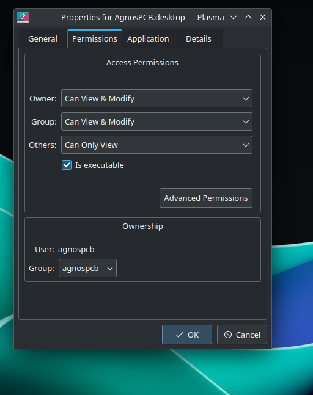
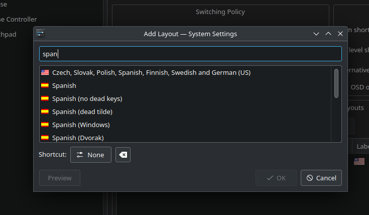
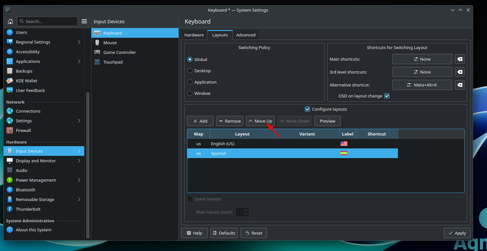
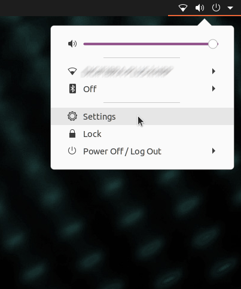
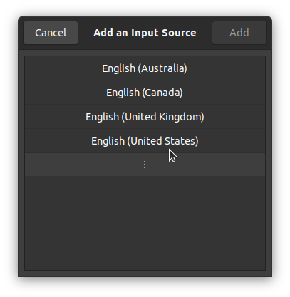
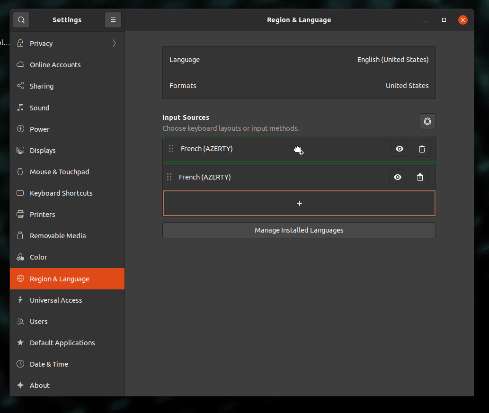
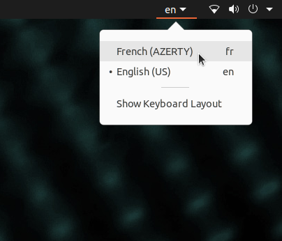

# **Fehlerbehebung**

??? info "Die Software startet/reagiert nicht"
    Entfernen Sie die Datei **setup.json** im Ordner **APP** und starten Sie die Anwendung anschließend erneut.
    !!! warning "Warnung"
        Alle Konfigurationen, wie das Mosaik-Menü, gehen verloren. Die REFERENZEN können später über die [Schaltfläche 'REFERENZ laden'](../how_to/Screen-layout.md#load-reference-as-file) erneut geladen werden. **ONLINE**-Benutzer müssen sich nach dem Löschen der Datei **setup.json** mit ihrem **AgnosPCB**-Konto anmelden.

??? info "Beim Versuch, die Anwendung zu starten, erscheint eine Meldung, dass die Datei keine Startberechtigung hat."
    Öffnen Sie ein Terminalfenster (Sie können die Tastenkombination **STRG + ALT + T** verwenden) und geben Sie Folgendes ein:

    ~~~
    chmod +x APP/Agnospcb.sh
    chmod +x APP/Agnospcb.bin
    ~~~

??? info "Die Kamera schließt die Initialisierungsprozedur nicht ab und kollidiert mit dem Rahmen"
    Sie können die Parameter für die Rückkehr zum Ursprung anpassen, indem Sie die Datei **machine.json** im Ordner **APP** bearbeiten. Es gibt drei Parameter, die die Achsen-Endschalter anpassen:

    ~~~
    {
    ...
    "xhome":60,
    "yhome":50,
    "zhome":30,
    ...
    }
    ~~~

    Ändern Sie die Parameter der betroffenen Achse, indem Sie den Wert **erhöhen**, wenn die Achse **nicht stoppt, wenn sie das Ende erreicht.** **Verringern** Sie den Wert, wenn die Achse **das Ende nicht erreicht**.

??? info "Ich erhalte 'Time-out'-Fehler bei der Inspektion meiner Schaltungen. Wie löse ich das Problem?"

    Dies könnte an einer langsamen Internetverbindung liegen. Vermeiden Sie die Verwendung einer Wi-Fi-Verbindung, um eine gute Geschwindigkeit zu gewährleisten. Es könnte auch sein, dass eine Firewall in Ihrem lokalen Netzwerk die Verbindung blockiert. Versuchen Sie, über die AOI auf die folgende [Webadresse](https://ai.agnospcb.com/) zuzugreifen, um zu prüfen, ob eine Firewall die Verbindung blockiert.

??? info "Die Empfindlichkeit kehrt nach einer Inspektion zum Standardwert zurück."

    Es gibt einen Parameter in der Datei **setup.json** namens **"remember_sensitivity"**. Bearbeiten Sie die Datei und setzen Sie diesen Wert auf **1**, um die Empfindlichkeit zwischen den Inspektionen beizubehalten.

??? info "Das Anwendungssymbol ist verschwunden. Wie kann ich es wiederherstellen?"

    !!! warning "Wichtig"

        Wählen Sie Ihre AOI-Version in den Registern unten aus.

    === "ONLINE-Version"
        1. Erstellen Sie eine Textdatei mit folgendem Inhalt:
            ~~~
            [Desktop Entry]
            Type=Application
            Name=AgnosPCB Client
            GenericName=AgnosPCB Cliente
            Icon=/home/agnospcb/APP/icons/circuit.png
            Exec=/home/agnospcb/APP/AgnosPCB.sh
            TryExec=/home/agnospcb/APP/AgnosPCB.sh
            Terminal=No
            Categories=Development;IDE;Debugger;ParallelComputing
            ~~~
        2. Speichern Sie diese als **AgnosPCB.desktop**
        3. Kopieren/verschieben Sie die Datei in den Desktop-Ordner.
        4. Klicken Sie auf dem Desktop mit der rechten Maustaste auf das Symbol -> **Eigenschaften** -> **Berechtigungen** -> **Ist ausführbar**

            
    
    === "OFFLINE-Version"
        1. Erstellen Sie eine Textdatei mit folgendem Inhalt:
            ~~~
            [Desktop Entry]
            Type=Application
            Name=AgnosPCB Client
            GenericName=AgnosPCB Cliente
            Icon=/home/agnospcb/APP/icons/circuit.png
            Exec=/home/agnospcb/APP/AgnosPCB.sh
            TryExec=/home/agnospcb/APP/AgnosPCB.sh
            Terminal=No
            Categories=Development;IDE;Debugger;ParallelComputing
            ~~~
        2. Speichern Sie diese als **AgnosPCB.desktop** und verschieben Sie sie in den Desktop-Ordner
        3. Öffnen Sie den Dateimanager

            

        4. Klicken Sie auf das Symbol mit den 3 Linien und dann auf **Einstellungen**

            

        5. Klicken Sie auf die Registerkarte Verhalten (Behavior) und wählen Sie "Mich fragen, was zu tun ist" (Ask me what to do)

            

        6. Starten Sie die Einheit neu.

        7. Klicken Sie mit der rechten Maustaste auf das Symbol > "**Ausführung erlauben**" (Allow launching)

            

??? info "Wie ändere ich das Tastaturlayout des Systems?"

    !!! warning "Wichtig"

        Wählen Sie Ihre AOI-Version in den Registern unten aus.
        
    === "ONLINE-Version"
        1. Öffnen Sie das Anwendungsmenü oben auf dem Desktop oder drücken Sie die Windows-Taste. Wählen Sie **Systemeinstellungen (System Settings)**.
            
            

        2. Navigieren Sie zu **Eingabegeräte (Input Devices)** > **Tastatur (Keyboard)** > **Layout**. Aktivieren Sie **Layouts konfigurieren (Configure layouts)** und drücken Sie **Hinzufügen (Add)**.

            

        3. Suchen Sie nach Ihrem Tastaturlayout und drücken Sie **Ok**.

            

        4. Verschieben Sie das Layout an die erste Stelle, indem Sie **Nach oben verschieben (Move up)** drücken.

            

    === "OFFLINE-Version"
        1. Öffnen Sie das Einstellungsmenü in der oberen rechten Ecke.

            

        2. Navigieren Sie zum Abschnitt **Region & Sprache (Region & Language)** > **Eingabequellen (Input Sources)** > **+**

            

        3. Klicken Sie auf das Symbol mit den 3 Punkten.

            

        4. Klicken Sie auf **Andere (Other)**.

            

        5. Suchen Sie nach Ihrer Sprache > **Hinzufügen (Add)**.

            

        6. Verschieben Sie das Layout in die erste Zeile.

            

        7. Wählen Sie das Layout in der oberen rechten Ecke aus.

            