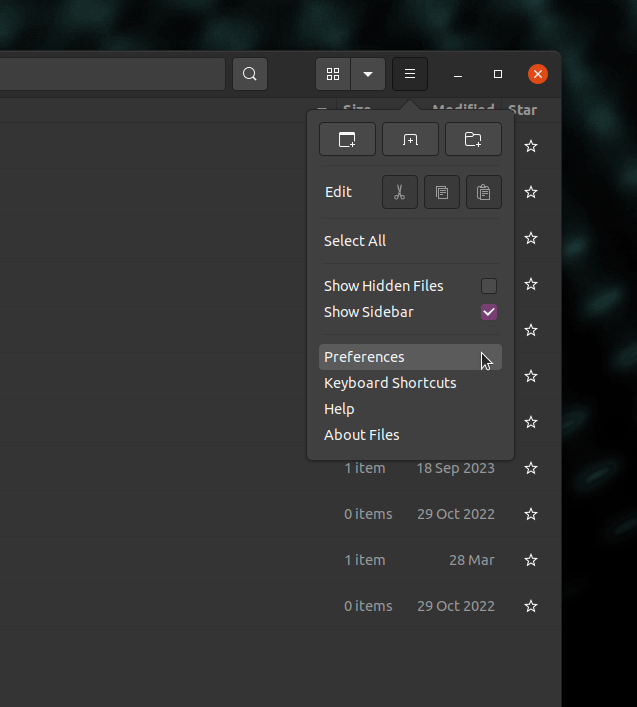
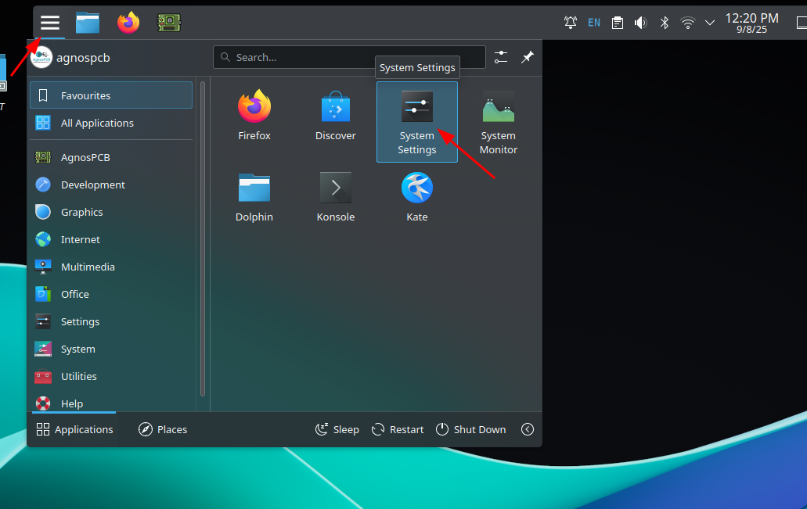
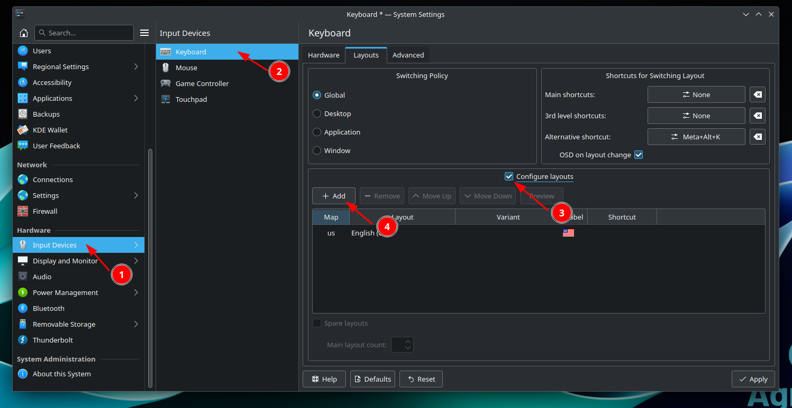
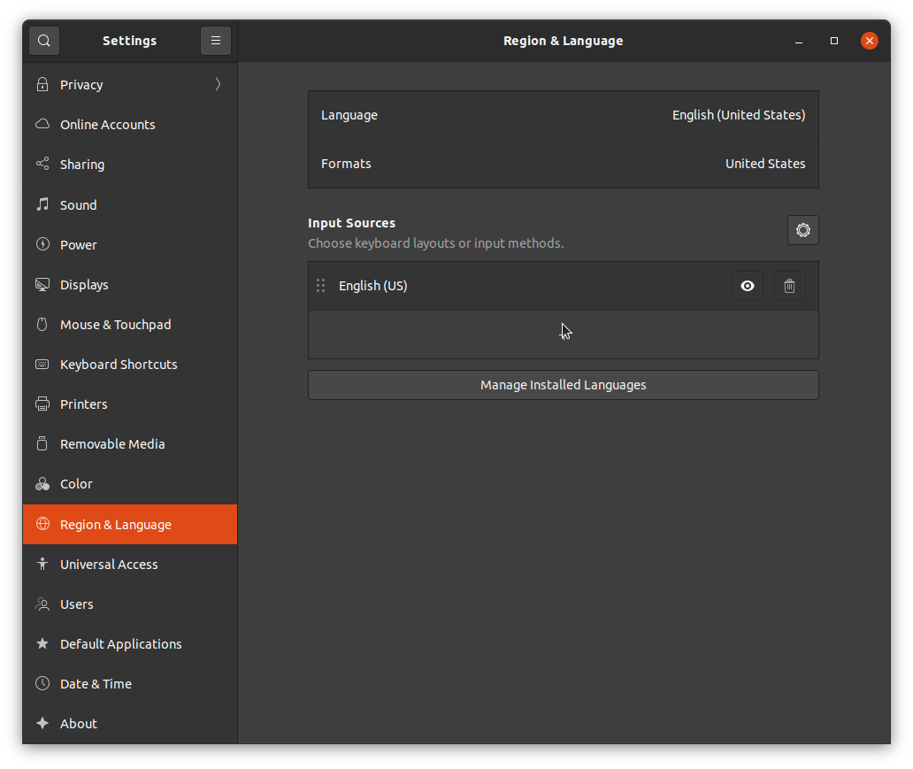

# **Dépannage**

??? info "Le logiciel ne démarre pas/ne répond pas"
    Supprimez le fichier **setup.json** situé dans le dossier **APP**, puis relancez l'application.
    !!! warning "Attention"
        Toutes les configurations, telles que le menu mosaïque, seront perdues. Les RÉFÉRENCES pourront être rechargées ultérieurement en utilisant le [bouton Charger RÉFÉRENCE](../how_to/Screen-layout.md#load-reference-as-file). Les utilisateurs **EN LIGNE** doivent se reconnecter avec leur compte **AgnosPCB** après avoir supprimé le fichier **setup.json**.

??? info "En essayant de lancer l'application, un message apparaît indiquant que le fichier n'a pas les permissions d'exécution."
    Ouvrez une fenêtre de terminal (vous pouvez utiliser le raccourci clavier **CTRL + ALT + T**) et tapez ce qui suit :

    ~~~
    chmod +x APP/Agnospcb.sh
    chmod +x APP/Agnospcb.bin
    ~~~

??? info "La caméra ne termine pas la procédure d'initialisation et entre en collision avec le cadre"
    Vous pouvez ajuster les paramètres de retour à l'origine en modifiant le fichier **machine.json**, situé dans le dossier **APP**. Il y a trois paramètres qui ajustent les fins de course des axes :

    ~~~
    {
    ...
    "xhome":60,
    "yhome":50,
    "zhome":30,
    ...
    }
    ~~~

    Modifiez les paramètres de l'axe affecté en **augmentant** la valeur si l'axe **ne s'arrête pas lorsqu'il atteint l'extrémité.** **Diminuez** la valeur si l'axe **n'atteint pas l'extrémité**.

??? info "J'obtiens des erreurs de « time-out » lors de l'inspection de mes circuits. Comment les résoudre ?"

    Cela pourrait être dû à une connexion Internet lente. Évitez d'utiliser une connexion **Wi-Fi** pour garantir une bonne vitesse. Il se pourrait également qu'un pare-feu sur votre réseau local bloque la connexion. Essayez d'accéder à l'[adresse web](https://ai.agnospcb.com/) suivante depuis l'AOI pour vérifier si un pare-feu bloque la connexion.

??? info "La sensibilité revient à la valeur par défaut après avoir effectué une inspection."

    Il y a un paramètre dans le fichier **setup.json** appelé **"remember_sensitivity"**. Modifiez le fichier et réglez cette valeur sur **1** pour conserver la sensibilité entre les inspections.

??? info "L'icône de l'application a disparu. Comment puis-je la restaurer ?"

    !!! warning "Important"

        Sélectionnez votre version d'AOI dans les onglets ci-dessous.

    === "Version EN LIGNE"
        1. Créez un fichier texte avec le contenu suivant :
            ~~~
            [Desktop Entry]
            Type=Application
            Name=AgnosPCB Client
            GenericName=AgnosPCB Cliente
            Icon=/home/agnospcb/APP/icons/circuit.png
            Exec=/home/agnospcb/APP/AgnosPCB.sh
            TryExec=/home/agnospcb/APP/AgnosPCB.sh
            Terminal=No
            Categories=Development;IDE;Debugger;ParallelComputing
            ~~~
        2. Enregistrez-le sous le nom **AgnosPCB.desktop**
        3. Copiez/déplacez le fichier dans le dossier Bureau (Desktop).
        4. Sur le bureau, faites un clic droit sur l'icône -> **Propriétés** -> **Permissions** -> **Est exécutable**

            
    
    === "Version HORS LIGNE (OFFLINE)"
        1. Créez un fichier texte avec le contenu suivant :
            ~~~
            [Desktop Entry]
            Type=Application
            Name=AgnosPCB Client
            GenericName=AgnosPCB Cliente
            Icon=/home/agnospcb/APP/icons/circuit.png
            Exec=/home/agnospcb/APP/AgnosPCB.sh
            TryExec=/home/agnospcb/APP/AgnosPCB.sh
            Terminal=No
            Categories=Development;IDE;Debugger;ParallelComputing
            ~~~
        2. Enregistrez-le sous le nom **AgnosPCB.desktop** et déplacez-le dans le dossier Bureau (Desktop).
        3. Ouvrez le gestionnaire de fichiers.

            

        4. Cliquez sur l'icône des 3 lignes, puis sur **Préférences**.

            

        5. Cliquez sur l'onglet Comportement (Behavior) et sélectionnez "Me demander quoi faire" (Ask me what to do).

            

        6. Redémarrez l'unité.

        7. Faites un clic droit sur l'icône > "**Autoriser l'exécution**" (Allow launching).

            

??? info "Comment changer la disposition du clavier du système ?"

    !!! warning "Important"

        Sélectionnez votre version d'AOI dans les onglets ci-dessous.
        
    === "Version EN LIGNE"
        1. Ouvrez le menu de l'application en haut du bureau ou appuyez sur la touche Windows. Sélectionnez **Paramètres du système (System Settings)**.
            
            

        2. Naviguez vers **Périphériques d'entrée (Input Devices)** > **Clavier (Keyboard)** > **Disposition (Layout)**. Activez **Configurer les dispositions (Configure layouts)** et appuyez sur **Ajouter (Add)**.

            

        3. Recherchez la disposition de votre clavier et appuyez sur **Ok**.

            

        4. Déplacez la disposition en première position en appuyant sur **Monter (Move up)**.

            

    === "Version HORS LIGNE (OFFLINE)"
        1. Ouvrez le menu des paramètres dans le coin supérieur droit.

            

        2. Naviguez vers la section **Région et Langue (Region & Language)** > **Sources d'entrée (Input Sources)** > **+**

            

        3. Appuyez sur l'icône des 3 points.

            

        4. Appuyez sur **Autre (Other)**.

            

        5. Recherchez votre langue > **Ajouter (Add)**.

            

        6. Déplacez la disposition sur la première ligne.

            

        7. Sélectionnez la disposition dans le coin supérieur droit.

            