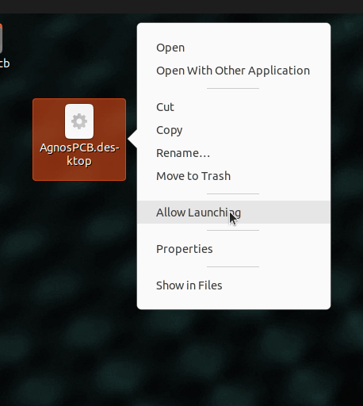

# **Risoluzione dei Problemi**

??? info "Il software non si avvia/non risponde"
    Rimuovi il file **setup.json** che si trova nella cartella **APP** e poi riavvia l'applicazione.
    !!! warning "Attenzione"
        Tutte le configurazioni, come il menu a mosaico, verranno perse. I RIFERIMENTI potranno essere ricaricati in seguito utilizzando il [pulsante Carica RIFERIMENTO (Load REFERENCE)](../how_to/Screen-layout.md#load-reference-as-file). **Gli utenti ONLINE** devono effettuare l'accesso con il loro account **AgnosPCB** dopo aver eliminato il file **setup.json**.

??? info "Quando si tenta di avviare l'applicazione, appare un messaggio che indica che il file non dispone delle autorizzazioni per l'avvio."
    Apri una finestra del terminale (puoi usare la scorciatoia da tastiera **CTRL + ALT + T**) e digita quanto segue:

    ~~~
    chmod +x APP/Agnospcb.sh
    chmod +x APP/Agnospcb.bin
    ~~~

??? info "La telecamera non completa la procedura di inizializzazione e si scontra con il telaio"
    Puoi regolare i parametri di ritorno all'origine modificando il file **machine.json**, che si trova nella cartella **APP**. Ci sono tre parametri che regolano i finecorsa degli assi:

    ~~~
    {
    ...
    "xhome":60,
    "yhome":50,
    "zhome":30,
    ...
    }
    ~~~

    Modifica i parametri dell'asse interessato **aumentando** il valore se l'asse **non si ferma quando raggiunge la fine**. **Diminuisci** il valore se l'asse **non raggiunge la fine**.

??? info "Ricevo errori di 'time-out' durante l'ispezione dei miei circuiti. Come posso risolverli?"

    Ciò potrebbe essere dovuto a una connessione internet lenta. Evita di usare una connessione Wi-Fi per garantire una buona velocità. Potrebbe anche essere che un firewall sulla tua rete locale stia bloccando la connessione. Prova ad accedere al seguente [indirizzo web](https://ai.agnospcb.com/) dall'AOI per verificare se un firewall sta bloccando la connessione.

??? info "La sensibilità torna al valore predefinito dopo aver eseguito un'ispezione."

    C'è un parametro nel file **setup.json** chiamato **"remember_sensitivity"**. Modifica il file e imposta questo valore su **1** per mantenere la sensibilità tra le ispezioni.

??? info "L'icona dell'applicazione è scomparsa. Come posso ripristinarla?"

    !!! warning "Importante"

        Seleziona la tua versione di AOI dalle schede qui sotto.

    === "Versione ONLINE"
        1. Crea un file di testo con il seguente contenuto:
            ~~~
            [Desktop Entry]
            Type=Application
            Name=AgnosPCB Client
            GenericName=AgnosPCB Cliente
            Icon=/home/agnospcb/APP/icons/circuit.png
            Exec=/home/agnospcb/APP/AgnosPCB.sh
            TryExec=/home/agnospcb/APP/AgnosPCB.sh
            Terminal=No
            Categories=Development;IDE;Debugger;ParallelComputing
            ~~~
        2. Salvalo come **AgnosPCB.desktop**
        3. Copia/sposta il file nella cartella Desktop.
        4. Sul desktop, clicca con il tasto destro sull'icona -> **Proprietà** -> **Permessi** -> **È eseguibile**

            
    
    === "Versione OFFLINE"
        1. Crea un file di testo con il seguente contenuto:
            ~~~
            [Desktop Entry]
            Type=Application
            Name=AgnosPCB Client
            GenericName=AgnosPCB Cliente
            Icon=/home/agnospcb/APP/icons/circuit.png
            Exec=/home/agnospcb/APP/AgnosPCB.sh
            TryExec=/home/agnospcb/APP/AgnosPCB.sh
            Terminal=No
            Categories=Development;IDE;Debugger;ParallelComputing
            ~~~
        2. Salvalo come **AgnosPCB.desktop** e spostalo nella cartella Desktop
        3. Apri il gestore file

            

        4. Clicca sull'icona delle 3 linee e poi su **Preferenze**

            

        5. Clicca sulla scheda Comportamento (Behavior) e seleziona "Chiedimi cosa fare" (Ask me what to do)

            

        6. Riavvia l'unità.

        7. Clicca con il tasto destro sull'icona > "**Consenti avvio**" (Allow launching)

            

??? info "Come si cambia il layout della tastiera di sistema?"

    !!! warning "Importante"

        Seleziona la tua versione di AOI dalle schede qui sotto.
        
    === "Versione ONLINE"
        1. Apri il menu dell'applicazione dalla parte superiore del desktop o premi il tasto Windows. Seleziona **Impostazioni di sistema (System Settings)**.
            
            

        2. Naviga su **Dispositivi di input (Input Devices)** > **Tastiera (Keyboard)** > **Layout**. Abilita **Configura layout (Configure layouts)** e premi **Aggiungi (Add)**.

            

        3. Cerca il layout della tua tastiera e premi **Ok**.

            

        4. Sposta il layout al primo posto premendo **Sposta su (Move up)**.

            

    === "Versione OFFLINE"
        1. Apri il menu delle impostazioni nell'angolo in alto a destra.

            

        2. Naviga nella sezione **Regione e Lingua (Region & Language)** > **Sorgenti di input (Input Sources)** > **+**

            

        3. Premi sull'icona dei 3 punti.

            

        4. Premi su **Altro (Other)**.

            

        5. Cerca la tua lingua > **Aggiungi (Add)**.

            

        6. Sposta il layout sulla prima riga.

            

        7. Seleziona il layout nell'angolo in alto a destra.

            