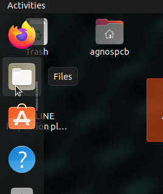
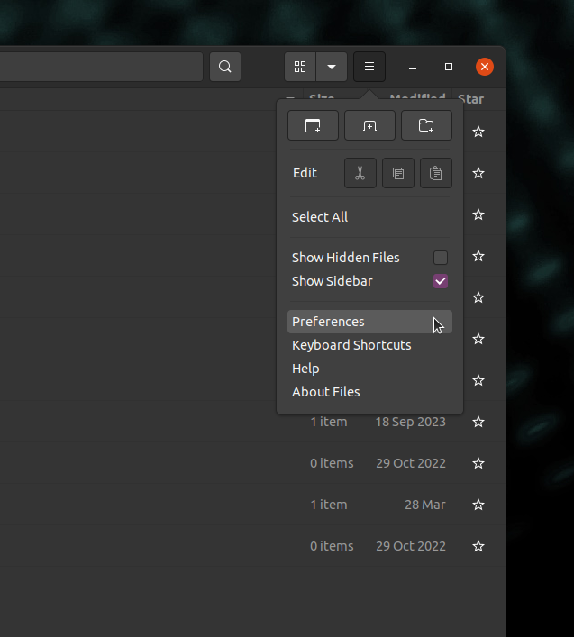
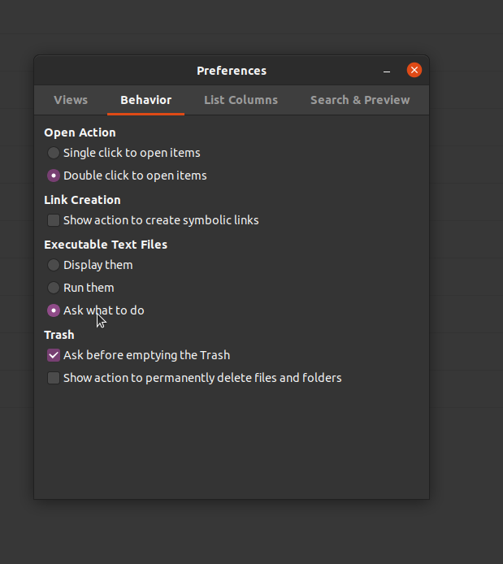
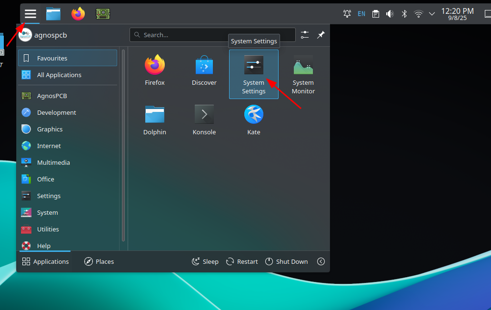
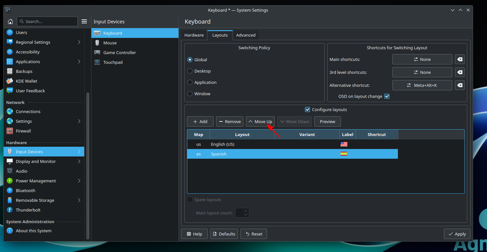
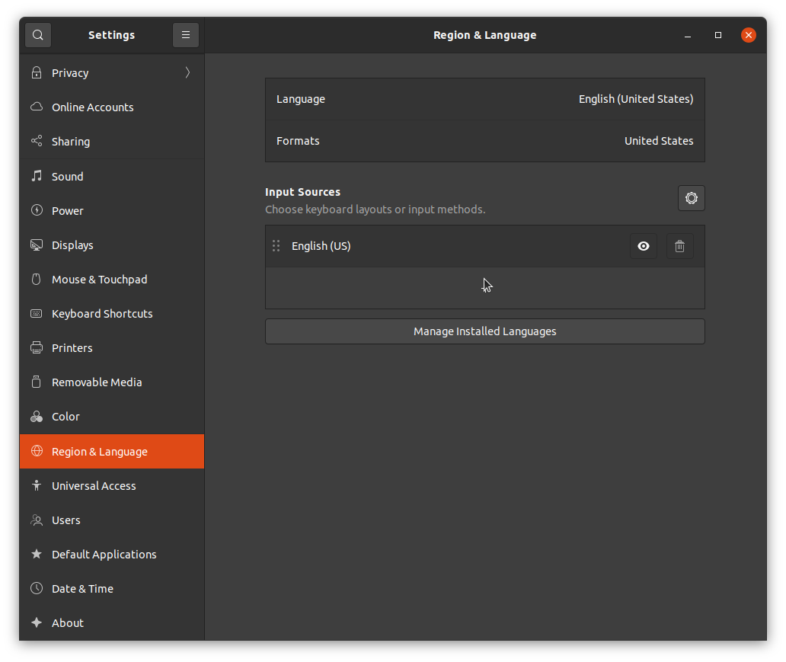
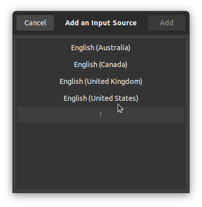
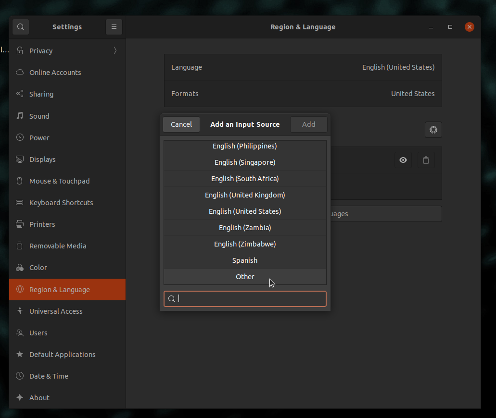
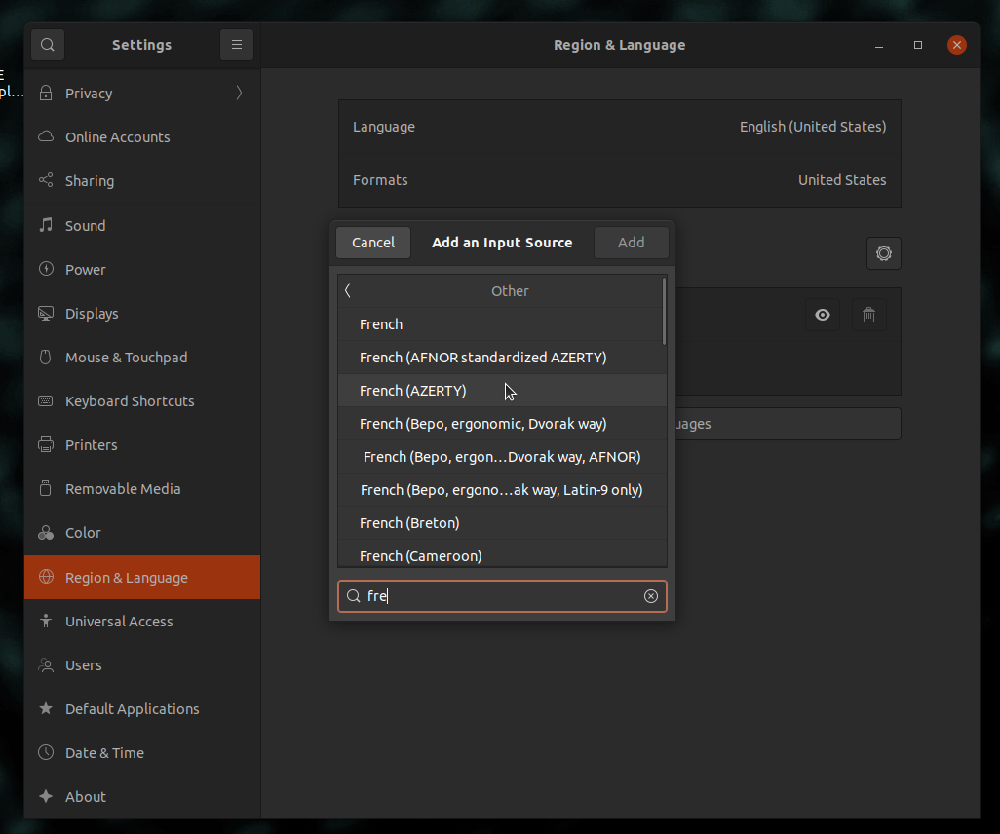
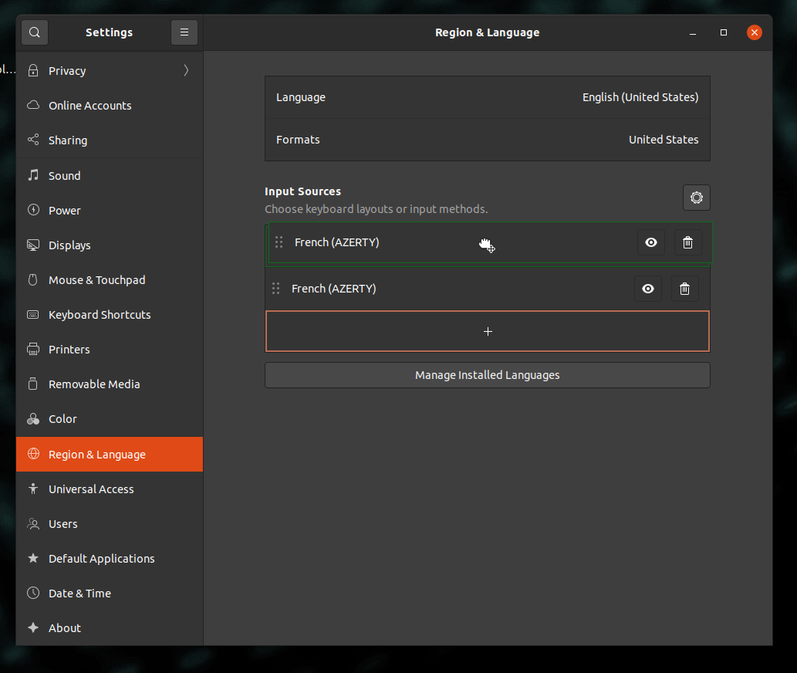

# **Troubleshooting**

??? info "The software does not start/respond"
    Remove the **setup.json** file located in the **APP** folder and then launch the application again.
    !!! warning "Warning"
        All configurations, such as the mosaic menu, will be lost. The REFERENCES can be loaded later by using the [Load REFERENCE button](../how_to/Screen-layout.md#load-reference-as-file). They can be reloaded later. **ONLINE** users must log in with their **AgnosPCB** account after deleting the **setup.json** file.

??? info "When trying to launch the application, a message appears saying that the file does not have permissions to launch."
    Open a terminal window (You can use the keyboard shortcut **CTRL + ALT + T**) and type the following:

    ~~~
    chmod +x APP/Agnospcb.sh
    chmod +x APP/Agnospcb.bin
    ~~~

??? info "The camera does not complete the initialization procedure and is colliding with the frame"
    You can adjust the return-to-origin parameters by editing the **machine.json** file, located in the **APP** folder. There are three parameters that adjust the axis endstops:

    ~~~
    {
    ...
    "xhome":60,
    "yhome":50,
    "zhome":30,
    ...
    }
    ~~~

    Modify the parameters of the affected axis by **increasing** the value if the axis **does not stop when it reaches the end.** **Decrease** the value if the axis **does not reach the end**.

??? info "I am getting “time-out” errors when inspecting my circuits. How do I solve it?"

    This could be due to a slow internet connection. Avoid using a Wi-Fi connection to ensure good speed. It could also be that a firewall on your local network is blocking the connection. Try accessing the following [web address](https://ai.agnospcb.com/) from the AOI to check if a firewall is blocking the connection.

??? info "The sensitivity returns to the default value after performing an inspection."

    There is a parameter in the **setup.json** file called **"remember_sensitivity"**. Modify the file and set this value to **1** to hold the sensitivity between inspections.

??? info "The application icon has disapeard. How can I restore it?"

    !!! warning "Important"

        Select your AOI version from the tabs below.

    === "ONLINE version"
        1. Create a text file with the following content:
            ~~~
            [Desktop Entry]
            Type=Application
            Name=AgnosPCB Client
            GenericName=AgnosPCB Cliente
            Icon=/home/agnospcb/APP/icons/circuit.png
            Exec=/home/agnospcb/APP/AgnosPCB.sh
            TryExec=/home/agnospcb/APP/AgnosPCB.sh
            Terminal=No
            Categories=Development;IDE;Debugger;ParallelComputing
            ~~~
        2. Save it as **AgnosPCB.desktop**
        3. Copy/move the file to the Desktop folder.
        4. In the desktop, right click on the icon -> **Properties** -> **Permisions** -> **Is executable**

            
    
    === "OFFLINE version"
        1. Create a text file with the following content:
            ~~~
            [Desktop Entry]
            Type=Application
            Name=AgnosPCB Client
            GenericName=AgnosPCB Cliente
            Icon=/home/agnospcb/APP/icons/circuit.png
            Exec=/home/agnospcb/APP/AgnosPCB.sh
            TryExec=/home/agnospcb/APP/AgnosPCB.sh
            Terminal=No
            Categories=Development;IDE;Debugger;ParallelComputing
            ~~~
        2. Save it as **AgnosPCB.desktop** and move it to the Desktop folder
        3. Open the file manager

            

        4. Click on the 3 lines icon and then **Preferences**

            

        5. Click on Behavior tab and select "Ask me what to do"

            

        6. Reboot the unit.

        7. Right click on the icon > "**Allow launching**"

            

??? info "How do I change the system keyboard layout?"

    !!! warning "Important"

        Select your AOI version from the tabs below.
        
    === "ONLINE version"
        1. Open application menu from the top of the desktop or press Windows key. Select **System Settings**.
            
            

        2. Navigate to **Input Devices** > **Keyboard** > **Layout**. Enable **Configure layouts** and press **Add**

            

        3. Look for your keyboard layout and press **Ok**

            

        4. Move the layout to the first place by pressing **Move up**

            

    === "OFFLINE version"
        1. Open the settings menu in the top right corner

            

        2. Navigate to **Region & Language** section > **Input Sources** > **+**

            

        3. Press in the 3 dots icon

            

        4. Press in **Other**

            

        5. Look for your language > **Add**

            

        6. Move the layout to the first row

            

        7. Select the layout in the top right corner

            