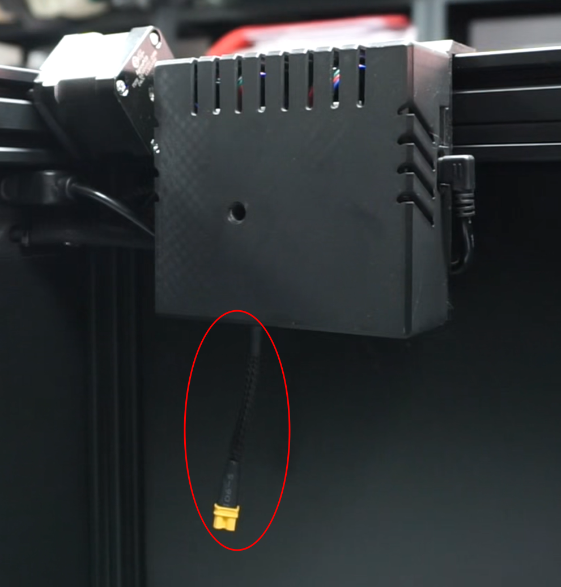
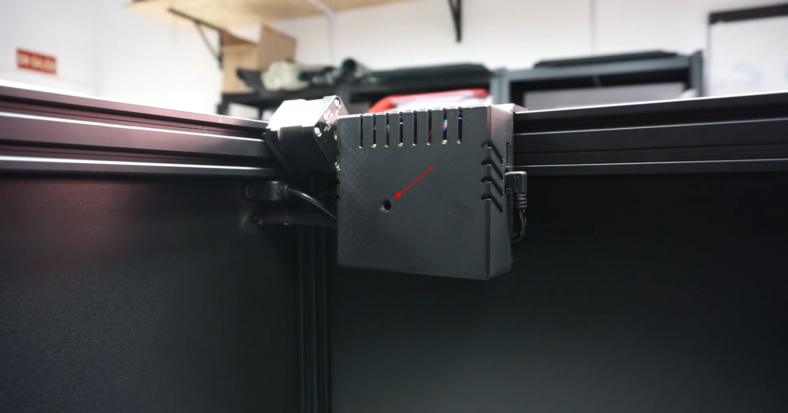
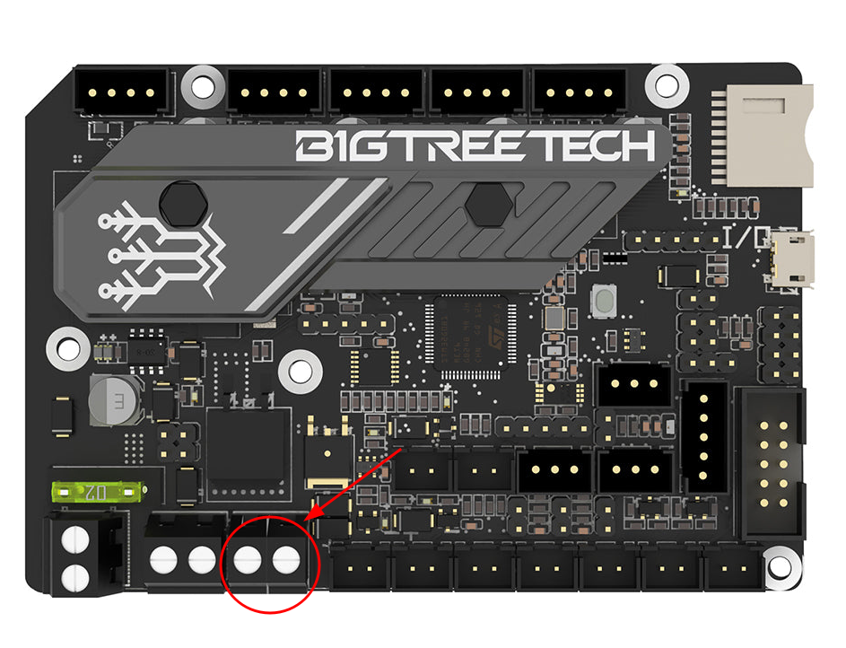
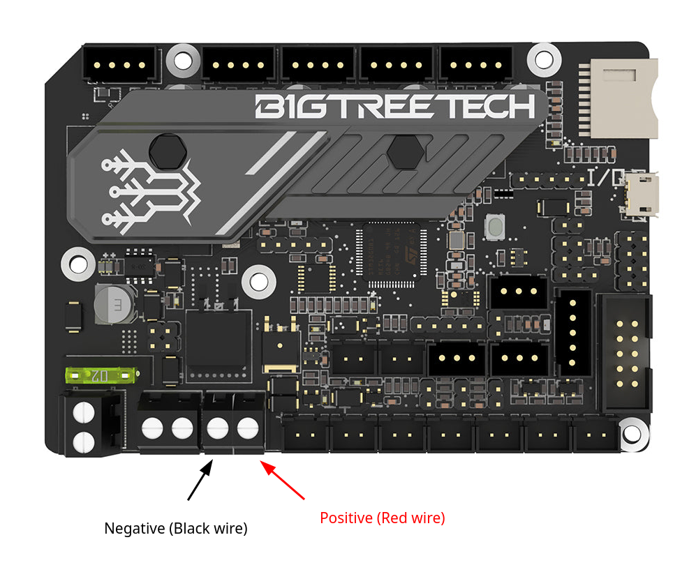
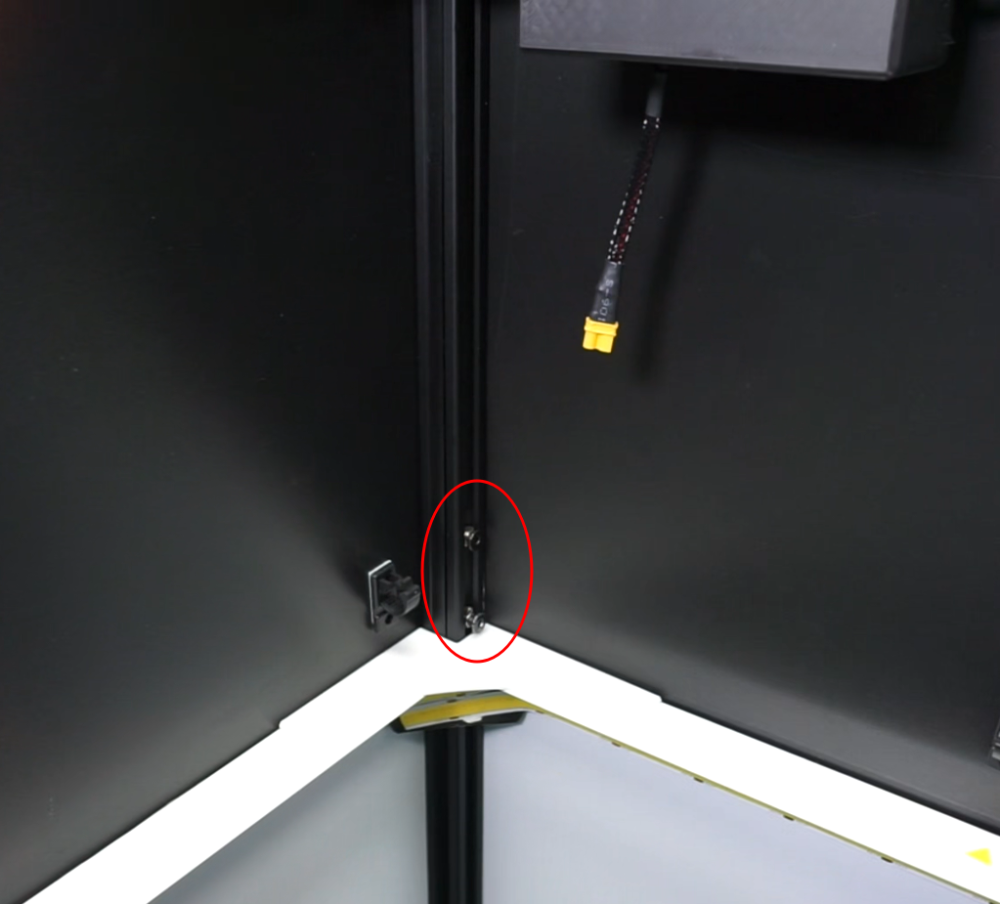
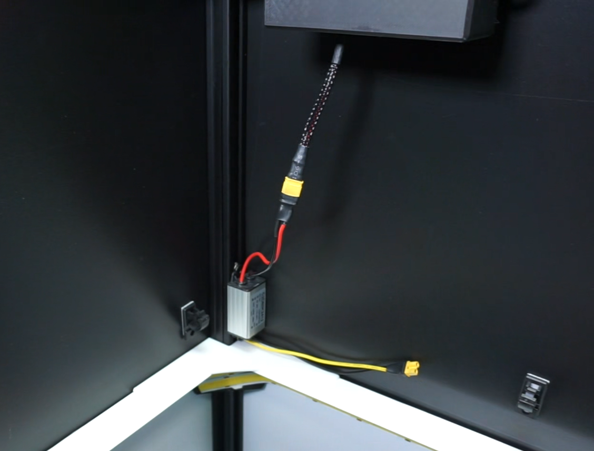
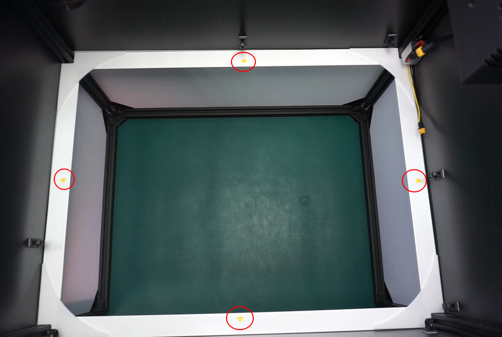
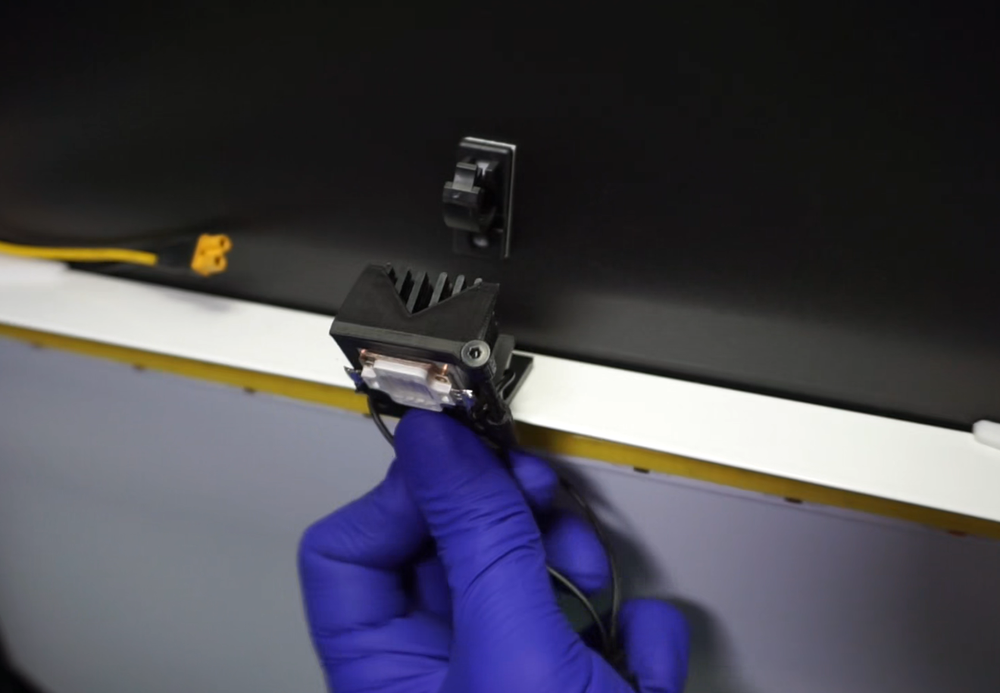
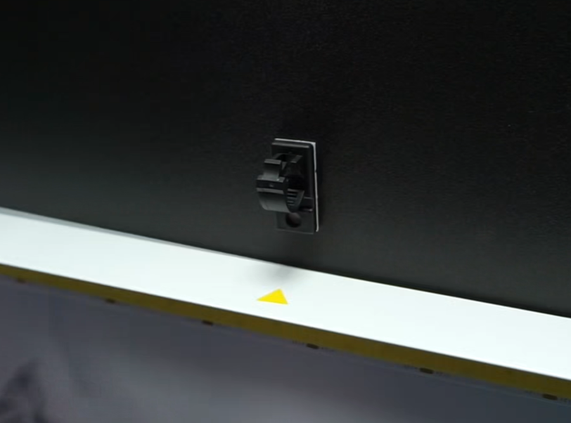
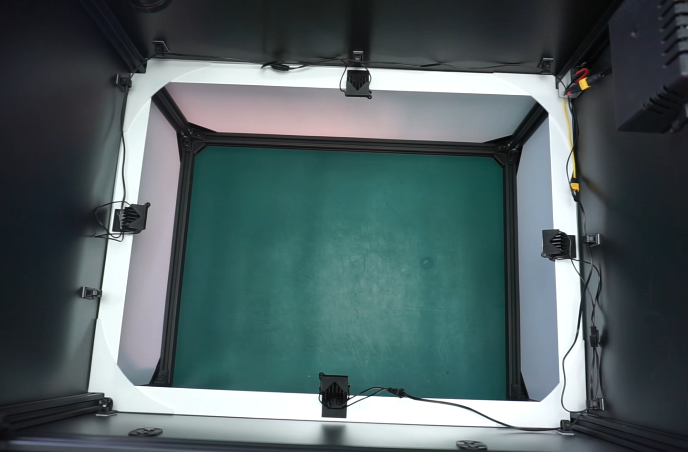

# Installazione del kit di rivestimento UV

Questa guida fornisce i passaggi necessari per installare il **modulo di ispezione del rivestimento UV** sull'**AOI AI-4050**.

## Video guida all'installazione

<iframe width="100%" height="400" src="https://www.youtube.com/embed/JY0PqEUxGlU" title="YouTube video player" frameborder="0" allow="accelerometer; autoplay; clipboard-write; encrypted-media; gyroscope; picture-in-picture; web-share" referrerpolicy="strict-origin-when-cross-origin" allowfullscreen></iframe>

## Elenco delle parti incluse

## Installazione del cavo di alimentazione

!!! note "Nota"

    Le unità nuove includono il cavo di alimentazione del modulo UV già preinstallato. Se la vostra AOI ha già questo cavo installato, passate al passo successivo.
    {width=200px .center}

La scheda di controllo si trova all'interno della camera di ispezione, nella parte superiore destra. Rimuovete l'adesivo di avvertenza dal coperchio e svitate la vite interna con un cacciavite esagonale. Rimuovete il coperchio in plastica della scheda di controllo.

{.center}

Allentate le viti del morsetto indicato nell'immagine.

{.center}

Collegate il filo nero al morsetto sinistro (negativo) e il filo rosso al morsetto destro (positivo). Assicuratevi che ogni filo sia completamente inserito nel morsetto e serrate entrambe le viti. Verificate che i collegamenti siano saldi tirandoli delicatamente.

{.center}

Una volta collegato il cavo, riposizionate il coperchio dell'alloggiamento e serrate la vite per fissarlo.

## Posizionamento e collegamento del convertitore DC step-down

Posizionate una delle viti M5 con il relativo dado, fornite con il kit, nella scanalatura del telaio verticale in alluminio sotto la scheda di controllo. Non serratela completamente per il momento.

Posizionate la seconda vite sopra la prima, a circa 10 centimetri di distanza.

{.center}

Posizionate il regolatore di tensione con il filo rosso rivolto verso l'alto e fissatelo con entrambe le viti.

!!! warning "Importante"
    Assicuratevi che i dadi possano ruotare all'interno della scanalatura e che le viti siano fissate correttamente.

Collegate i fili nero e rosso al cavo di alimentazione della scheda di controllo.

{.center}

## Installazione dei LED UV

Posizionate i LED UV sul bordo superiore dell'anello luminoso, in corrispondenza dei segni a triangolo giallo, oppure, se non presenti, al centro di ciascun lato.

{.center}

Inserite il supporto del LED nella parte superiore del bordo bianco, lasciando il LED rivolto verso l'alto, e premete finché non sentite un clic. Ripetete questa procedura con i restanti 3 LED.

{.center}

Incollate le guide dei cavi sopra l'anello di illuminazione con l'apertura della clip rivolta verso l'alto. Posizionatele nei punti migliori per instradare con facilità i cavi UV.

{.center}

## Collegamento dei LED UV al convertitore DC

Con i LED UV già installati, collegate il cavo di alimentazione a "Y" alla parte inferiore del convertitore DC step-down (fili nero e giallo) e proseguite collegando ciascun LED al proprio pin corrispondente. Notate che uno dei fili è più corto dell'altro.

Fate passare i fili attraverso le guide precedentemente installate, assicurandovi che non siano visibili alla telecamera.

{.center}
