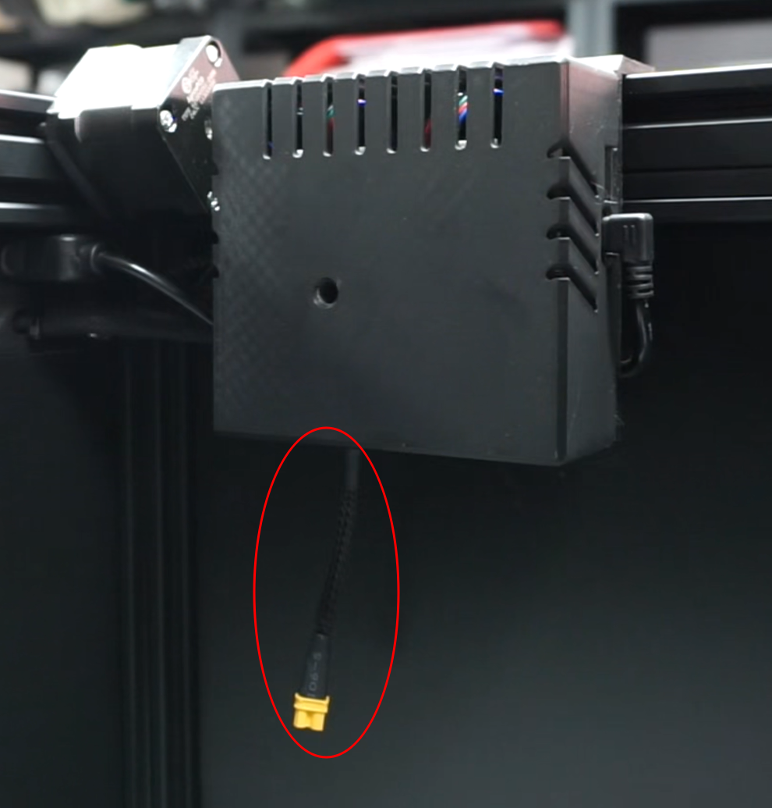
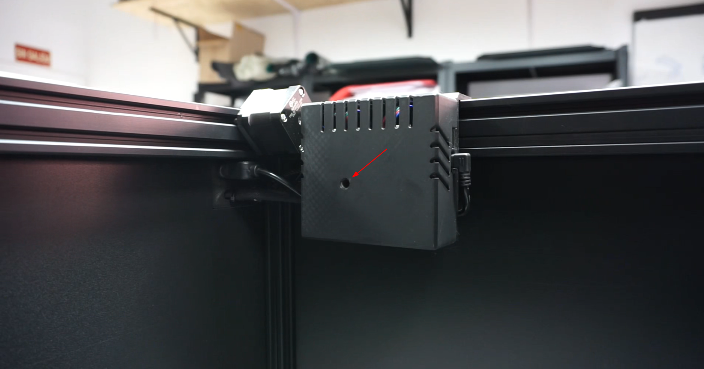
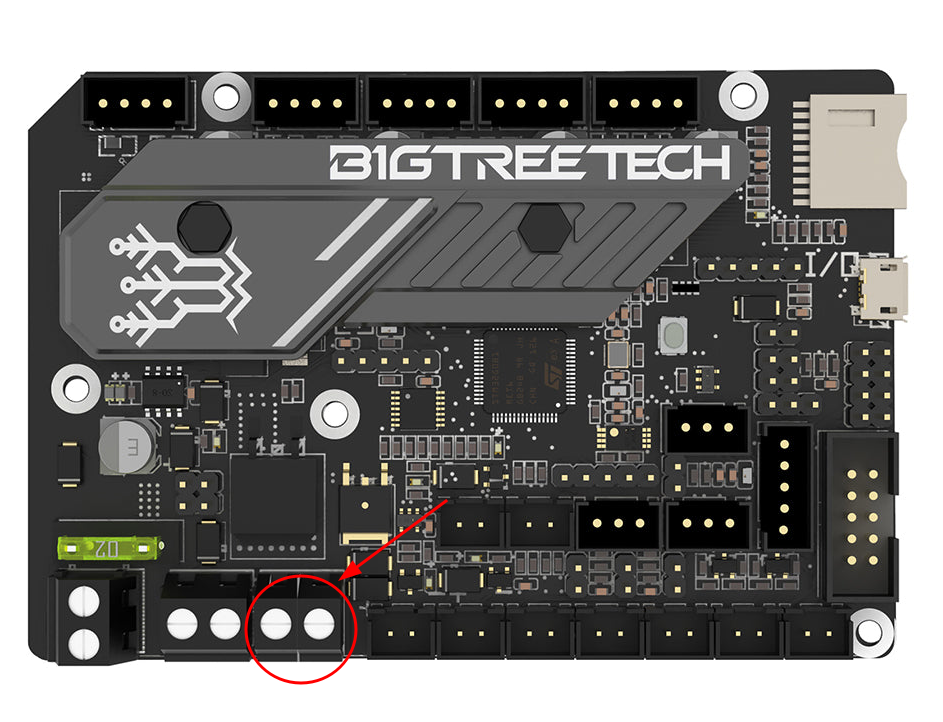
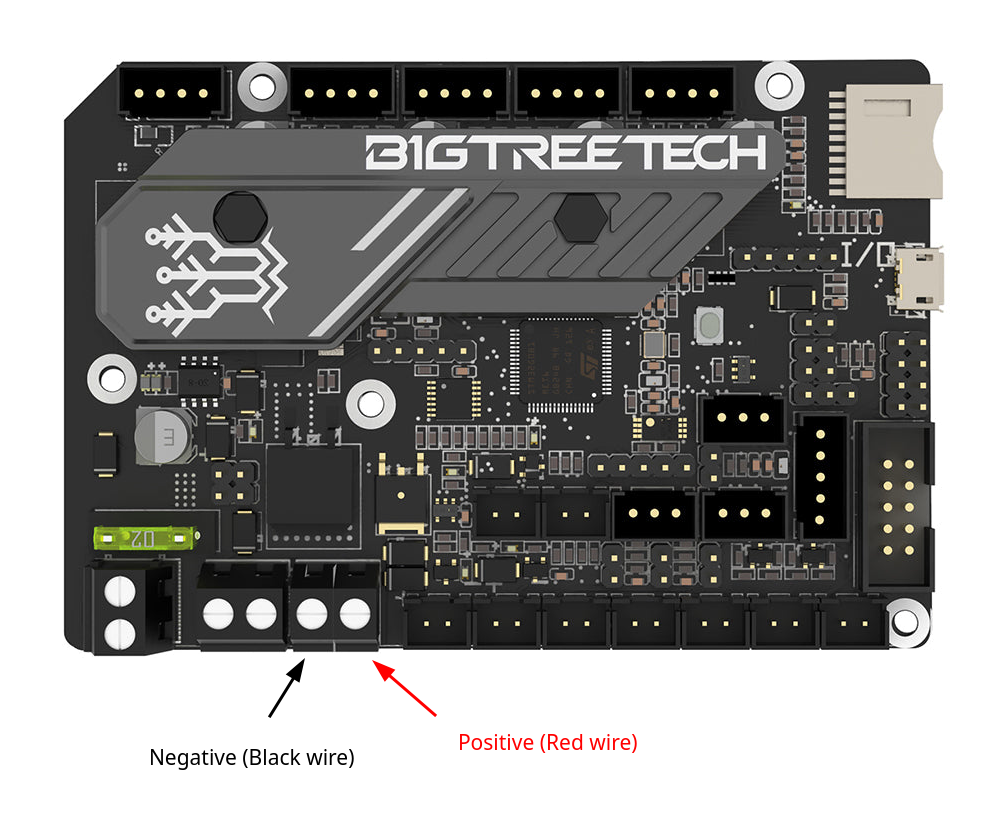
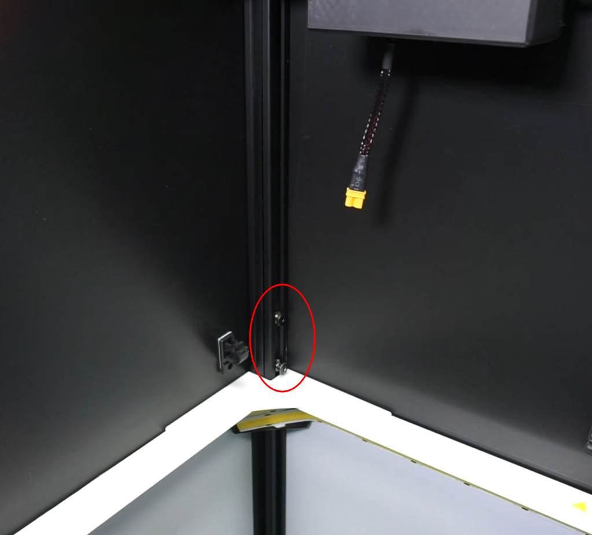
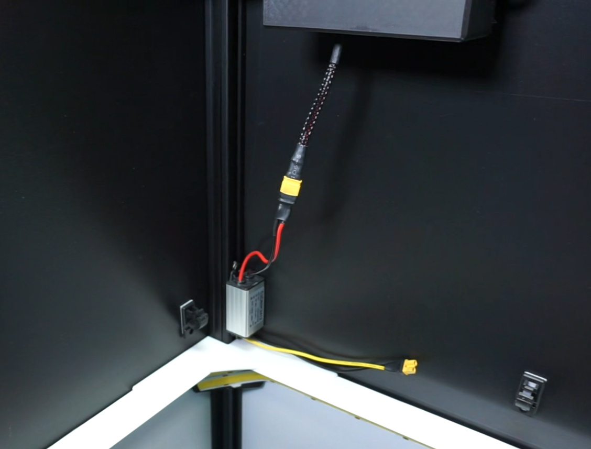
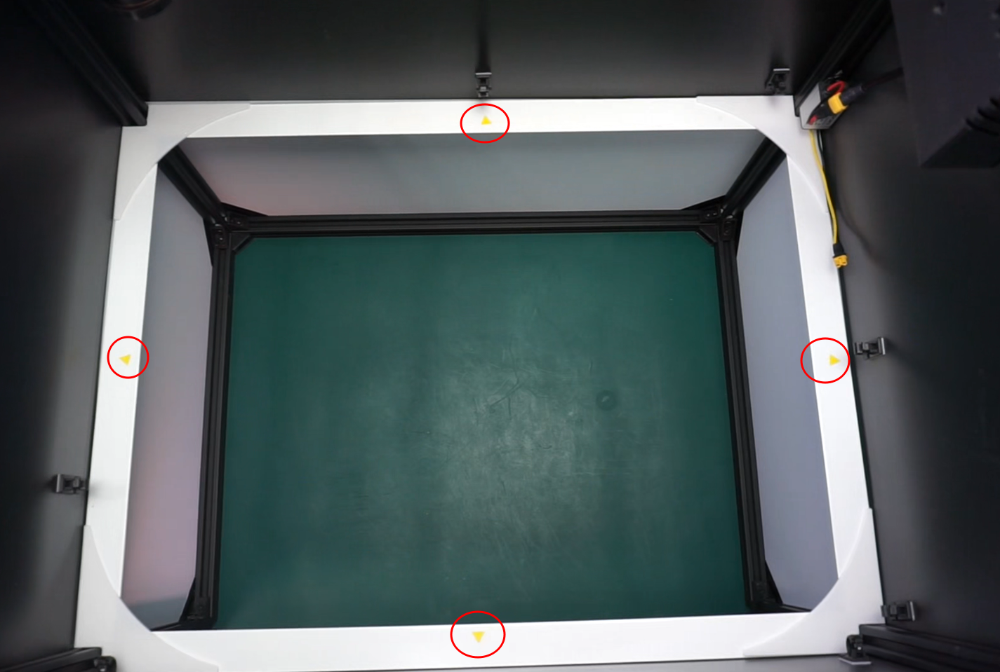
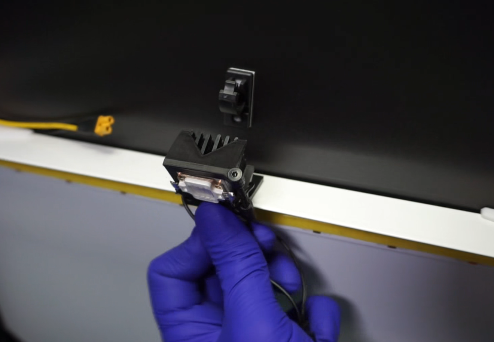
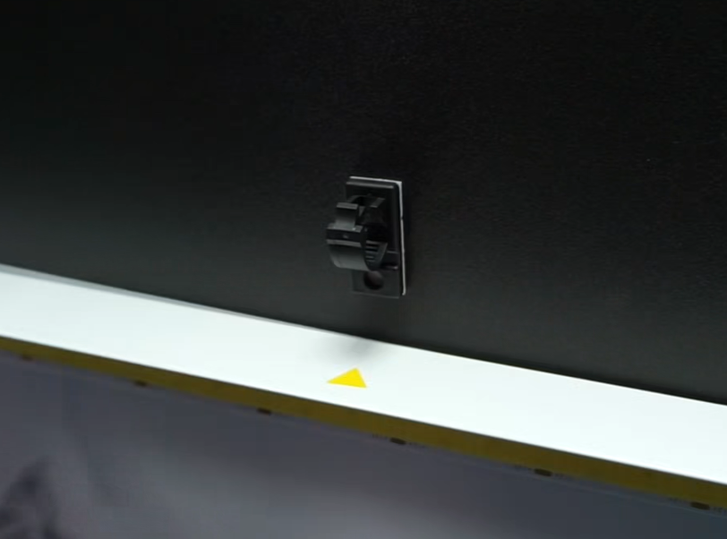
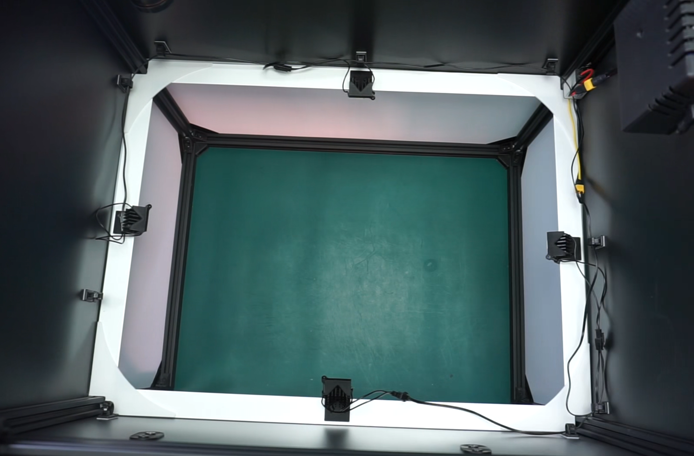

This guide provides the necessary steps to install the **UV coating inspection module** on the **AI-4050 AOI**.

## Video Installation Guide

<iframe width="100%" height="400" src="https://www.youtube.com/watch?v=JY0PqEUxGlU?si=" title="YouTube video player" frameborder="0" allow="accelerometer; autoplay; clipboard-write; encrypted-media; gyroscope; picture-in-picture; web-share" referrerpolicy="strict-origin-when-cross-origin" allowfullscreen></iframe>

## List of included parts

## Installing the power cable

!!! Note "Note"

    New units include the UV module power cable pre-installed. If your AOI already has this cable installed, skip to the next step.
    {width=200px; .center}

The control board is located inside of the inspection chamber on the top-right side. Remove the warning sticker from the cover and unscrew the screw inside using a hex screwdriver. Remove the plastic cover of the control board.

Loosen the screws on the terminal indicated in the image.

Connect the black wire to the left terminal (negative) and the red wire to the right terminal (positive). Make sure each wire is fully inserted into the terminal and tighten both screws. Check that the connections are secure by gently tugging on them.

Once the cable is connected, place the housing cover back in its position and tighten the screw to secure it.

## Placing and connecting the DC stepdown converter

Place one of the M5 screws with their nut provided with the kit in the slot of the vertical aluminum frame under the control board. Don't tighten it completely yet.

Place the second screw on top of the first, approximately 10 centimeters away.

 Position the voltage regulator with the red wire facing upwards and secure it with both screws.

!!! warning "Important"
    Ensure the nuts rotate within the slot and the screws are properly secured.

Connect the black and red wires to the control board's power cable.

## Installing the UV leds

Place the UV LEDs on the top edge of the ring light, at the yellow triangle marks, or, if they are not marked, in the middle of each side. 

Insert the LED holder into the top of the white edge, leaving the LED at the top, and press until you hear a click. Repeat this process with the remaining 3 LEDs.

Glue the cable guides above the lighting ring with the clamp opening facing upwards. Position them in the best locations to route the UV cables with ease.

## Conecting UV leds to DC converter

With the UV LEDs already installed, connect the "Y" power cable to the bottom of the stepdown DC converter (black and yellow wires) and continue connecting each LED to its corresponding pin. Note that one of the wires is shorter than the other. 

Route the wires through the guides previously installed, ensuring they are not visible to the camera.

