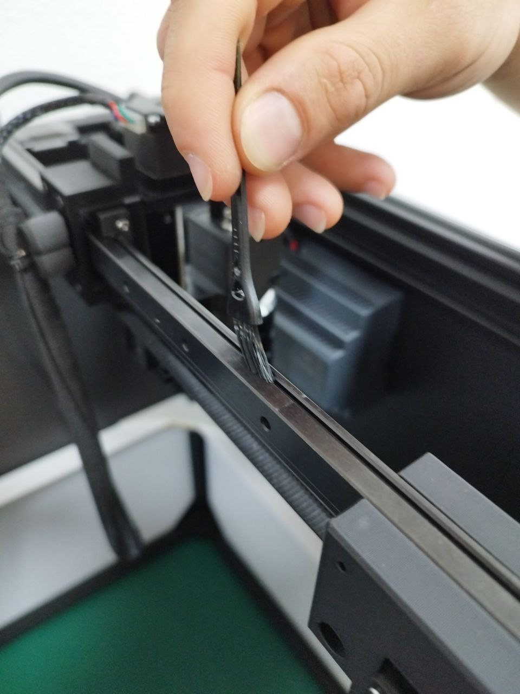
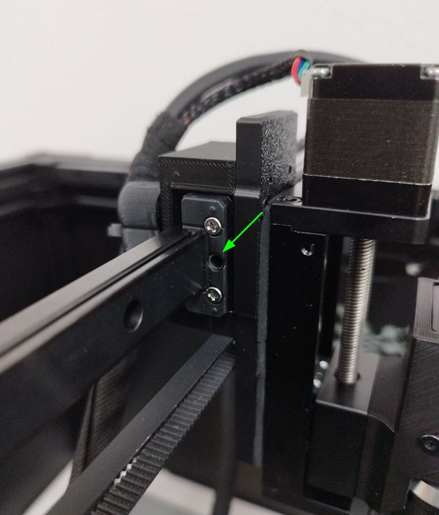

# **Wartung**

Die **AgnosPCB AI-4050** AOI erfordert nur sehr wenig Wartung, diese ist jedoch wichtig für den korrekten Betrieb des Systems.

{width=600px, .center}

| Wartung | Häufigkeit |
| --------- | :-----: |
| [Einstellung der Riemenspannung](#einstellung-der-riemenspannung) | Monatlich |
| [Reinigung](#reinigung) | Monatlich |
| [Schmierung der Schienenführung](#schmierung-der-schienenführung) | Alle 6 Monate |

---
## **Einstellung der Riemenspannung**

Wenn Sie beim Bewegen der Kamera eine übermäßige Riemenvibration bemerken oder der Wagen der Y-Achse nicht senkrecht zur X-Achse steht, folgen Sie der nachstehenden Prozedur, um die Riemen zu spannen:

**Schritt 1**

Ziehen Sie das Ende des Riemens aus der Öffnung.

{width=400px, .center}

**Schritt 2**

Lösen Sie die Sechskantschraube gerade so weit, dass Sie den Riemen ziehen können.

{width=400px, .center}

**Schritt 3**

Ziehen Sie den Riemen, bis er entlang der gesamten Länge der Schienen gerade und straff ist.

{width=400px, .center}

**Schritt 4**

Ziehen Sie die Schraube fest, um den Riemen zu sichern.

**Schritt 5**

Führen Sie das Ende des Riemens in die Öffnung ein.

{width=400px, .center}

**Schritt 6**

Wiederholen Sie die Schritte 1 bis 5 für die andere Schiene, falls erforderlich.

---
## **Reinigung**

!!! warning "Warnung"
    Verwenden Sie keine flüssigen Reiniger, Alkohol oder Entfetter auf beweglichen Teilen (Schienen, Wagen, Spindel usw.) oder elektrischen Komponenten.

**Schritt 1**

Trennen Sie das Netzteil oder das AC-Kabel von der Rückseite der Maschine.

Siehe rot:

{width=400px, .center}

**Schritt 2**

Verwenden Sie eine Serviette oder ein Wattestäbchen, um das alte Fett von den linearen Schienen zu entfernen.

{width=400px, .center}

**Schritt 3**

Verwenden Sie die im Wartungskit enthaltene Bürste, um jegliche Verunreinigung im Inneren der Schienen zu entfernen.

{width=400px, .center}

{width=400px, .center}

**Schritt 4**

Verwenden Sie den im Wartungskit enthaltenen Blasebalg, um die Kameralinse abzupusten und Schmutz zu entfernen.

{width=400px, .center}

!!! note "Hinweis"
    Optional können Sie die Linse **nach** der Verwendung des Blasebalgs mit einem Mikrofasertuch reinigen, da sich möglicherweise Partikel darauf befinden, die die Linse zerkratzen könnten.

---
## **Schmierung der Schienenführung**

!!! warning "Warnung"
    Bevor Sie die Wagen schmieren, stellen Sie sicher, dass Sie die Schienen [reinigen](maintenance.md#reinigung).

**Schritt 1**

Trennen Sie das Netzteil oder das AC-Kabel von der Rückseite der Maschine.

Siehe rot:

{width=400px, .center}

**Schritt 2**

Führen Sie das Ende des im Wartungskit enthaltenen Fettdosierers in die Öffnung an der Seite des Schienenwagens ein.

{width=400px, .center}

{width=400px, .center}

**Schritt 3**

Tragen Sie etwas Fett auf den Wagen auf.

{width=400px, .center}

**Schritt 4**

Bewegen Sie die Wagen manuell, um das Fett entlang der Schienen zu verteilen.

{width=400px, .center}

**Schritt 5**

Verbinden Sie das Netzteil oder das AC-Kabel mit der Plattform.