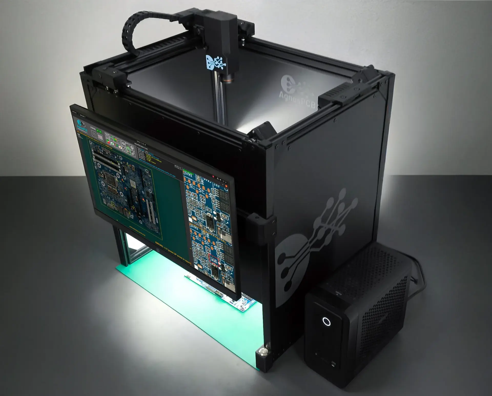
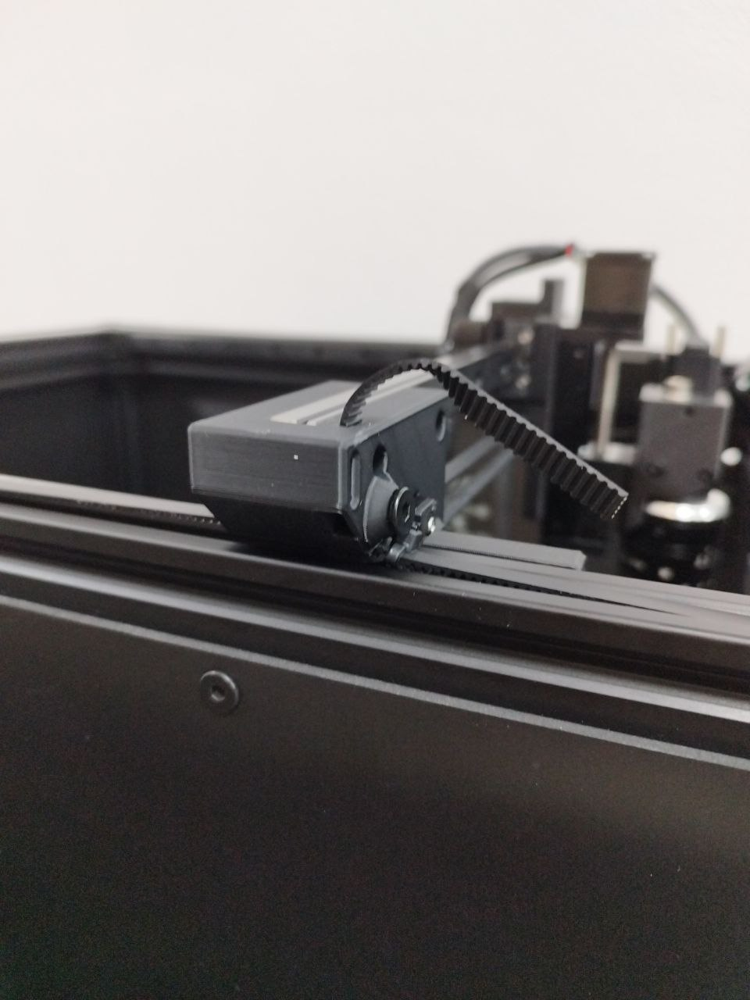
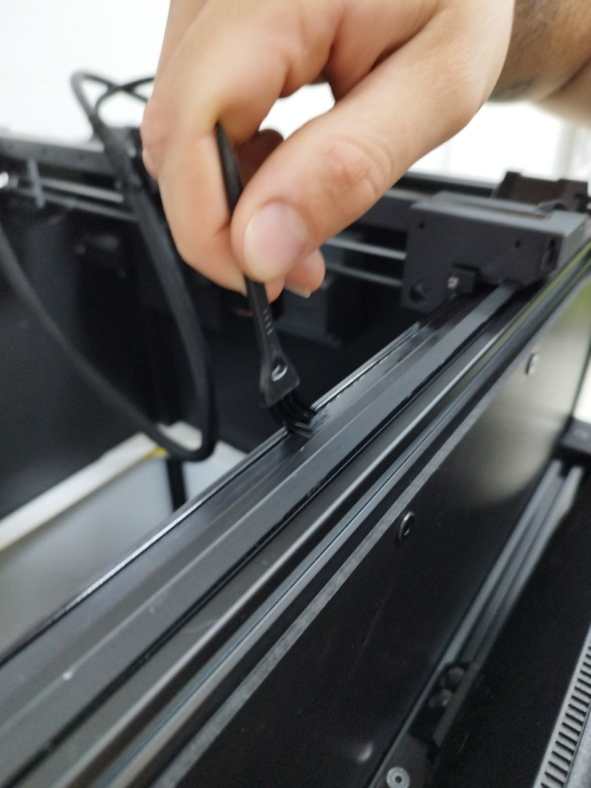
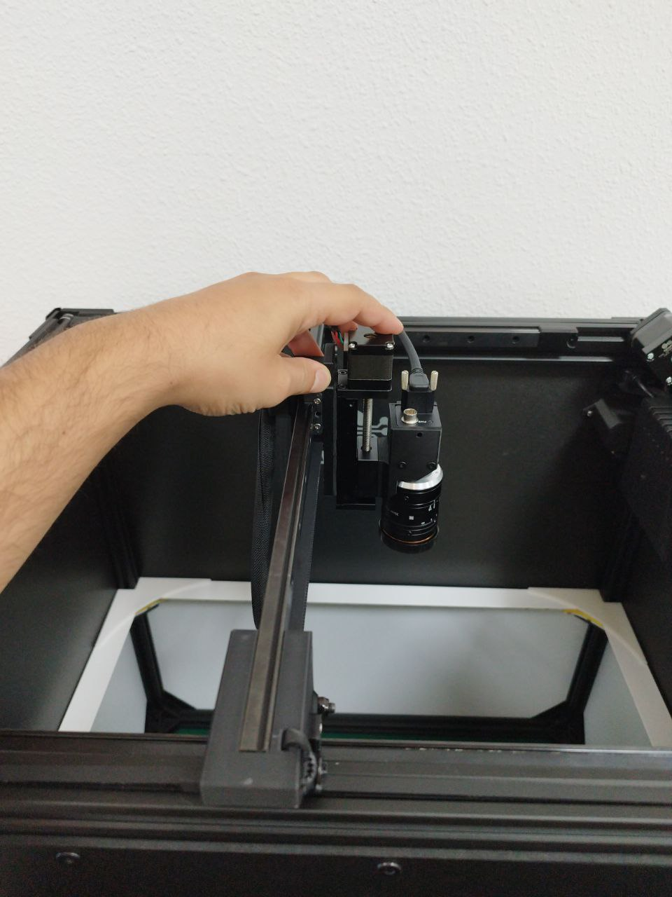

# **Mantenimiento**

El AOI **AgnosPCB AI-4050** requiere muy poco mantenimiento, pero es importante para el correcto funcionamiento del sistema.

{width=600px, .center}

| Mantenimiento | Periodicidad |
| --------- | :-----: |
| [Ajuste de la tensión de las correas](#ajuste-de-la-tensión-de-las-correas) | Mensual |
| [Limpieza](#limpieza) | Mensual |
| [Lubricación de la guía del riel](#lubricación-de-la-guía-del-riel) | 6 meses |

---
## **Ajuste de la tensión de las correas**

Si nota una vibración excesiva de las correas cuando la cámara se mueve o si el carro del eje Y no está perpendicular al eje X, siga el procedimiento a continuación para tensar las correas:

**Paso 1**

Saque el extremo de la correa del orificio.

{width=400px, .center}

**Paso 2**

Afloje el tornillo hexagonal lo suficiente para poder tirar de la correa.

{width=400px, .center}

**Paso 3**

Tire de la correa hasta que esté recta y tensa a lo largo de toda la longitud de los rieles.

{width=400px, .center}

**Paso 4**

Apriete el tornillo para asegurar la correa en su lugar.

**Paso 5**

Inserte el extremo de la correa en el orificio.

{width=400px, .center}

**Paso 6**

Repita los pasos 1 al 5 para el otro riel si es necesario.

---
## **Limpieza**

!!! warning "Advertencia"
    No utilice ningún limpiador líquido, alcohol o desengrasante en las partes móviles (rieles, carros, husillo, etc.) o componentes eléctricos.

**Paso 1**

Desconecte la fuente de alimentación o el cable de CA del panel trasero de la máquina.

Ver rojo:

{width=400px, .center}

**Paso 2**

Utilice una servilleta o un bastoncillo de algodón para quitar la grasa vieja de los rieles lineales.

{width=400px, .center}

**Paso 3**

Utilice el cepillo provisto en el kit de mantenimiento para eliminar cualquier contaminación dentro de los rieles.

{width=400px, .center}

{width=400px, .center}

**Paso 4**

Utilice el soplador de aire incluido en el kit de mantenimiento para soplar la lente de la cámara y eliminar cualquier residuo.

{width=400px, .center}

!!! note "Nota"
    Opcionalmente, puede limpiar la lente con un paño de limpieza de microfibra **después** de usar el soplador, ya que podría haber partículas que rayen la lente.

---
## **Lubricación de la guía del riel**

!!! warning "Advertencia"
    Antes de lubricar los carros, asegúrese de [limpiar](maintenance.md#limpieza) los rieles.

**Paso 1**

Desconecte la fuente de alimentación o el cable de CA del panel trasero de la máquina.

Ver rojo:

{width=400px, .center}

**Paso 2**

Inserte el extremo del dispensador de grasa provisto en el kit de mantenimiento en el orificio lateral del carro del riel.

{width=400px, .center}

{width=400px, .center}

**Paso 3**

Aplique un poco de grasa al carro.

{width=400px, .center}

**Paso 4**

Mueva los carros manualmente para distribuir la grasa a lo largo de los rieles.

{width=400px, .center}

**Paso 5**

Conecte la fuente de alimentación o el cable de CA a la plataforma.