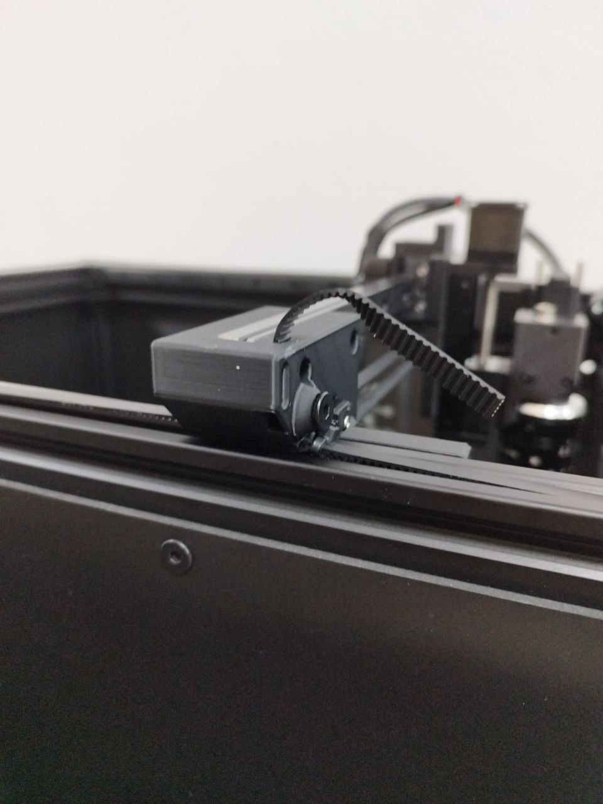
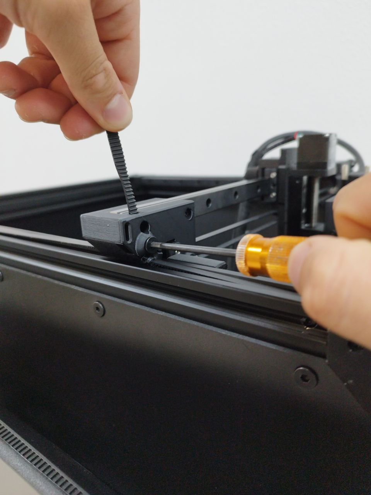
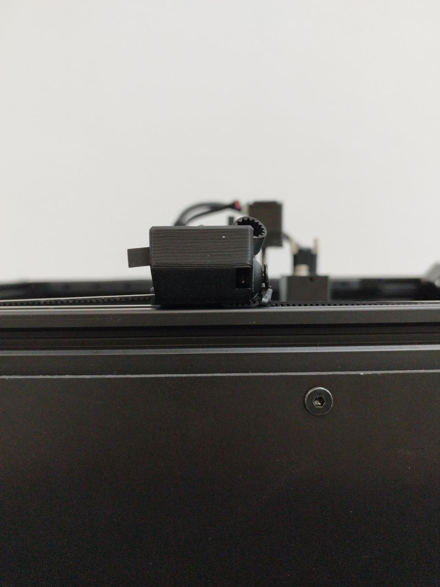
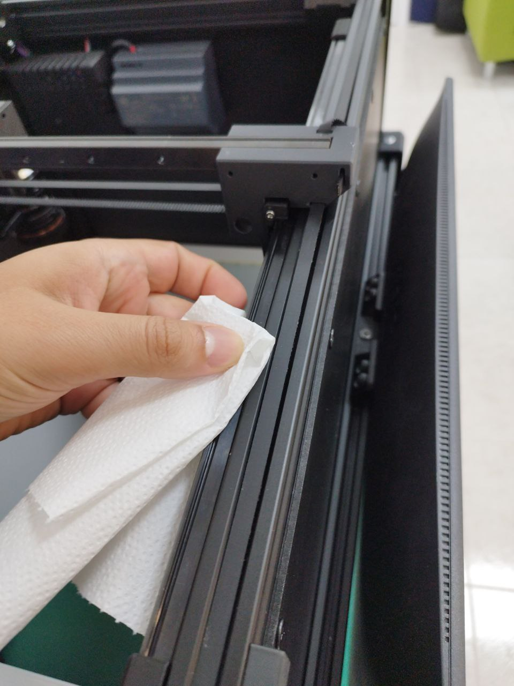
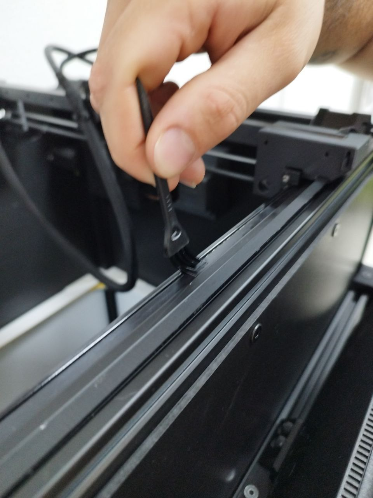
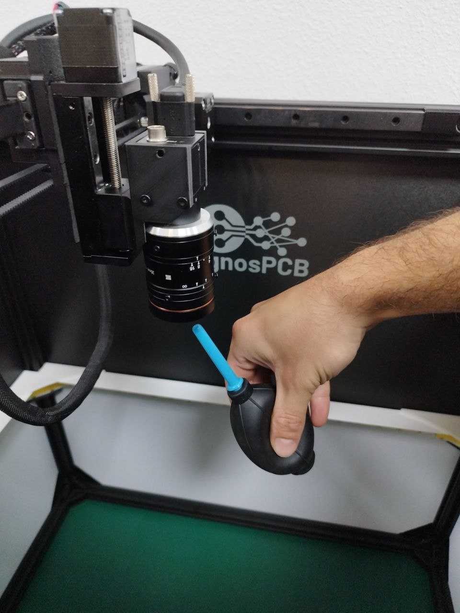
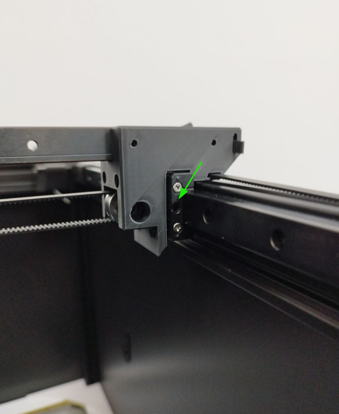
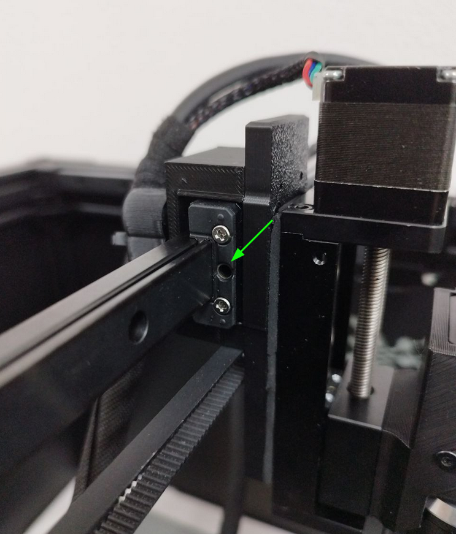
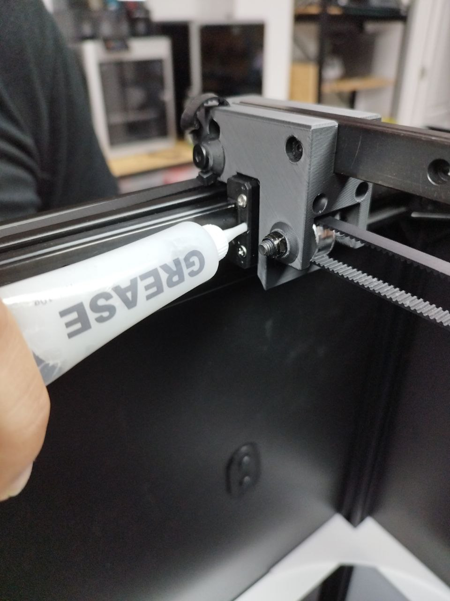
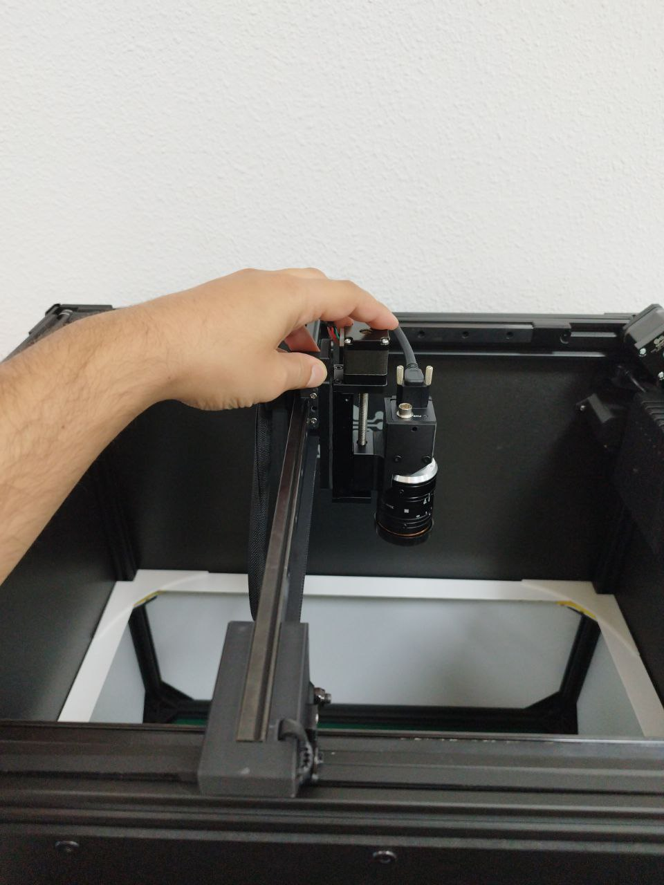

# **Maintenance**

L'AOI **AgnosPCB AI-4050** nécessite très peu d'entretien, mais celui-ci est important pour le bon fonctionnement du système.

{width=600px, .center}

| Entretien | Périodicité |
| --------- | :-----: |
| [Réglage de la tension des courroies](#réglage-de-la-tension-des-courroies) | Mensuel |
| [Nettoyage](#nettoyage) | Mensuel |
| [Lubrification du guide-rail](#lubrification-du-guide-rail) | 6 mois |

---
## **Réglage de la tension des courroies**

Si vous remarquez une vibration excessive des courroies lorsque la caméra se déplace ou si le chariot de l'axe Y n'est pas perpendiculaire à l'axe X, suivez la procédure ci-dessous pour tendre les courroies :

**Étape 1**

Tirez l'extrémité de la courroie hors du trou.

{width=400px, .center}

**Étape 2**

Desserrer la vis hexagonale juste assez pour pouvoir tirer la courroie.

{width=400px, .center}

**Étape 3**

Tirez la courroie jusqu'à ce qu'elle soit droite et tendue sur toute la longueur des rails.

{width=400px, .center}

**Étape 4**

Serrez la vis pour fixer la courroie en place.

**Étape 5**

Insérez l'extrémité de la courroie dans le trou.

{width=400px, .center}

**Étape 6**

Répétez les étapes 1 à 5 pour l'autre rail si nécessaire.

---
## **Nettoyage**

!!! warning "Attention"
    N'utilisez aucun nettoyant liquide, alcool ou dégraissant sur les pièces mobiles (rails, chariots, broche, etc.) ou les composants électriques.

**Étape 1**

Débranchez l'alimentation ou le cordon CA du panneau arrière de la machine.

Voir en rouge :

{width=400px, .center}

**Étape 2**

Utilisez une serviette ou un coton-tige pour enlever l'ancienne graisse des rails linéaires.

{width=400px, .center}

**Étape 3**

Utilisez la brosse fournie dans le kit d'entretien pour enlever toute contamination à l'intérieur des rails.

{width=400px, .center}

{width=400px, .center}

**Étape 4**

Utilisez la soufflette à air incluse dans le kit d'entretien pour souffler la lentille de la caméra et enlever tout débris.

{width=400px, .center}

!!! note "Note"
    En option, vous pouvez nettoyer la lentille avec un chiffon de nettoyage en microfibre **après** avoir utilisé la soufflette, car il pourrait y avoir des particules susceptibles de rayer la lentille.

---
## **Lubrification du guide-rail**

!!! warning "Attention"
    Avant de lubrifier les chariots, assurez-vous de [nettoyer](maintenance.md#nettoyage) les rails.

**Étape 1**

Débranchez l'alimentation ou le cordon CA du panneau arrière de la machine.

Voir en rouge :

{width=400px, .center}

**Étape 2**

Insérez l'extrémité du distributeur de graisse fourni dans le kit d'entretien dans le trou sur le côté du chariot du rail.

{width=400px, .center}

{width=400px, .center}

**Étape 3**

Appliquez un peu de graisse sur le chariot.

{width=400px, .center}

**Étape 4**

Déplacez les chariots manuellement pour distribuer la graisse le long des rails.

{width=400px, .center}

**Étape 5**

Connectez l'alimentation ou le cordon CA à la plateforme.