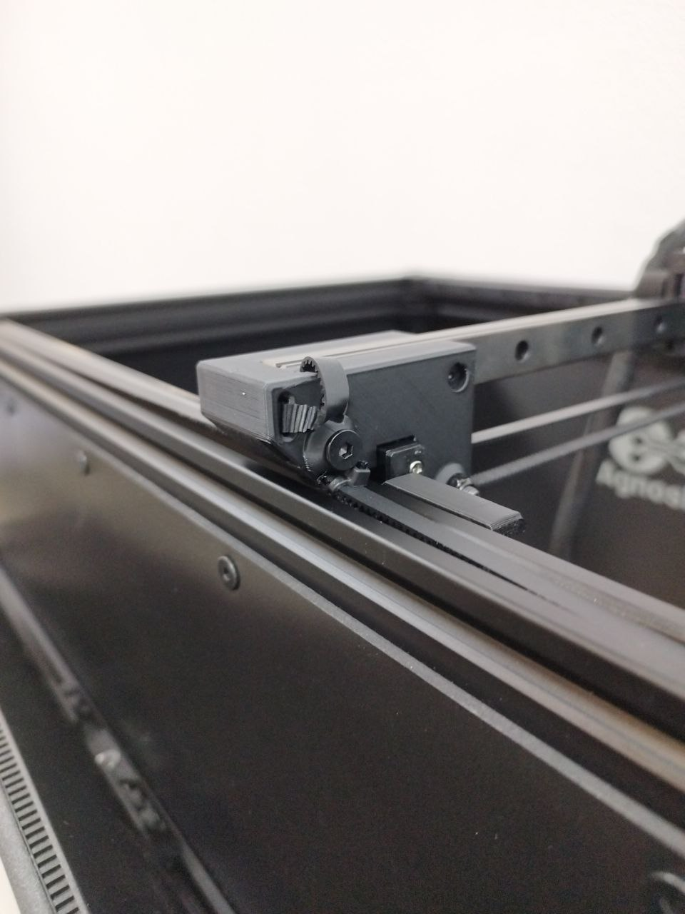

# **Manutenzione**

La AOI **AgnosPCB AI-4050** richiede una manutenzione minima, ma è anche importante per il corretto funzionamento del sistema.

{width=600px, .center}

| Manutenzione | Periodicità |
| --------- | :-----: |
| [Regolazione della tensione delle cinghie](#regolazione-della-tensione-delle-cinghie) | Mensile |
| [Pulizia](#pulizia) | Mensile |
| [Lubrificazione delle guide lineari](#lubrificazione-delle-guide-lineari) | 6 mesi |

## **Regolazione della tensione delle cinghie**

Se noti una vibrazione eccessiva della cinghia quando la telecamera si muove o se il carrello dell'asse Y non è perpendicolare all'asse X, segui la procedura sottostante per tensionare le cinghie:

**Passaggio 1**

Estrai l'estremità della cinghia dal foro.

{width=400px, .center}

**Passaggio 2**

Allenta la vite esagonale quanto basta per poter tirare la cinghia.

{width=400px, .center}

**Passaggio 3**

Tira la cinghia finché non è dritta e tesa lungo l'intera lunghezza delle guide.

{width=400px, .center}

**Passaggio 4**

Stringi la vite per fissare la cinghia in posizione.

**Passaggio 5**

Inserisci l'estremità della cinghia nel foro.

{width=400px, .center}

**Passaggio 6**

Ripeti i passaggi da 1 a 5 per l'altra guida, se necessario.

---
## **Pulizia**

!!! warning "Attenzione"
    Non utilizzare detergenti liquidi, alcol o sgrassatori su parti in movimento (guide, carrelli, mandrino, ecc.) o componenti elettrici.

**Passaggio 1**

Scollega l'alimentatore o il cavo CA dal pannello posteriore della macchina.

Vedi rosso:

{width=400px, .center}

**Passaggio 2**

Usa un tovagliolo o un bastoncino di cotone per rimuovere il vecchio grasso dalle guide lineari.

{width=400px, .center}

**Passaggio 3**

Usa la spazzola fornita nel kit di manutenzione per rimuovere qualsiasi contaminazione all'interno delle guide.

{width=400px, .center}

{width=400px, .center}

**Passaggio 4**

Usa il soffiatore ad aria incluso nel kit di manutenzione per soffiare sull'obiettivo della telecamera e rimuovere eventuali detriti.

{width=400px, .center}

!!! note "Nota"
    Opzionalmente, puoi pulire l'obiettivo con un panno in microfibra **dopo** aver usato il soffiatore, poiché potrebbero esserci particelle in grado di graffiare l'obiettivo.

---
## **Lubrificazione delle guide lineari**

!!! warning "Attenzione"
    Prima di lubrificare i carrelli, assicurati di [pulire](maintenance.md#pulizia) le guide.

**Passaggio 1**

Scollega l'alimentatore o il cavo CA dal pannello posteriore della macchina.

Vedi rosso:

{width=400px, .center}

**Passaggio 2**

Inserisci l'estremità del dosatore di grasso fornito nel kit di manutenzione nel foro sul lato del carrello della guida.

{width=400px, .center}

{width=400px, .center}

**Passaggio 3**

Applica un po' di grasso al carrello.

{width=400px, .center}

**Passaggio 4**

Sposta manualmente i carrelli per distribuire il grasso lungo le guide.

{width=400px, .center}

**Passaggio 5**

Collega l'alimentatore o il cavo CA alla piattaforma.