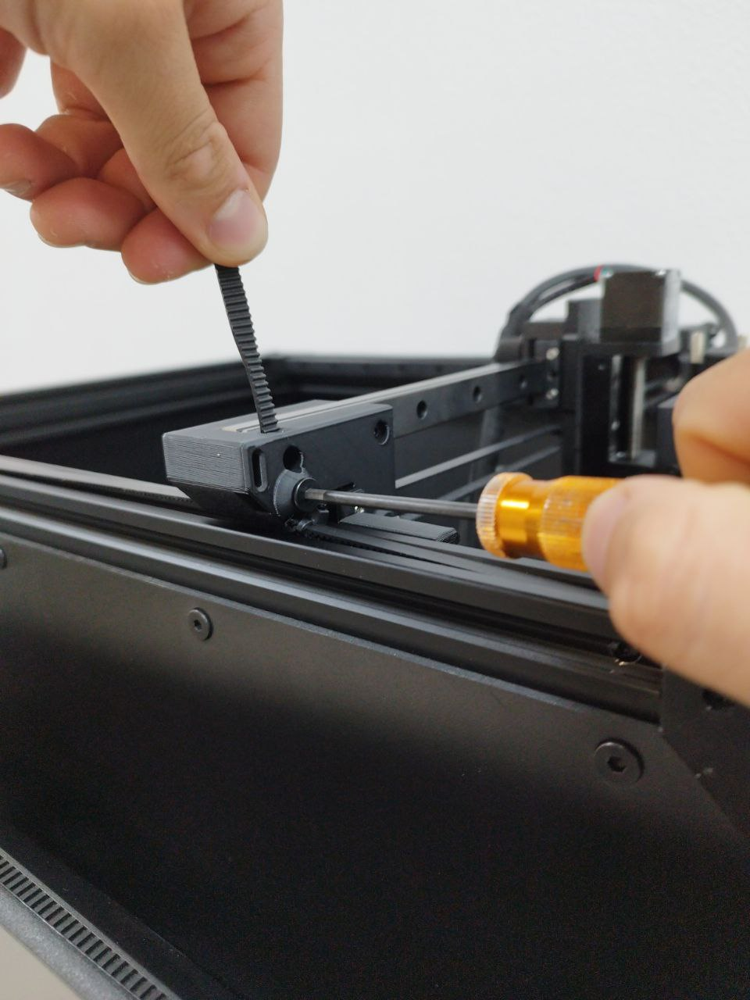
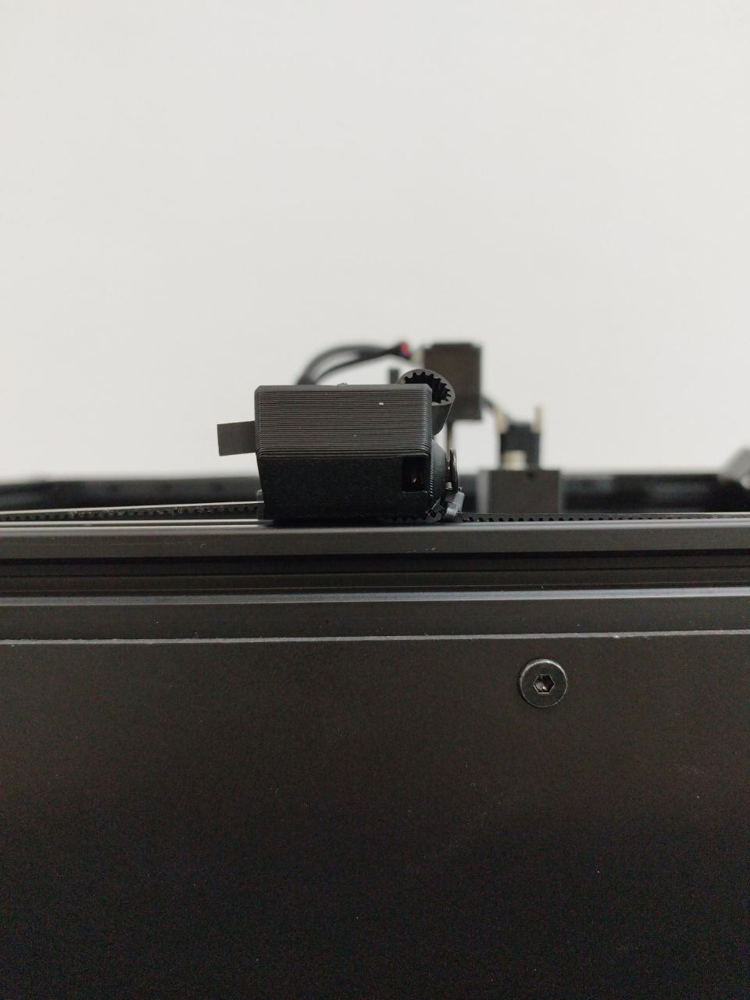
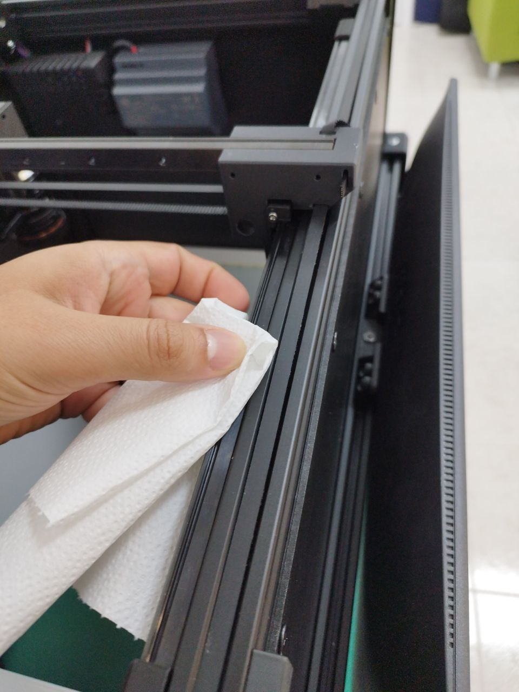
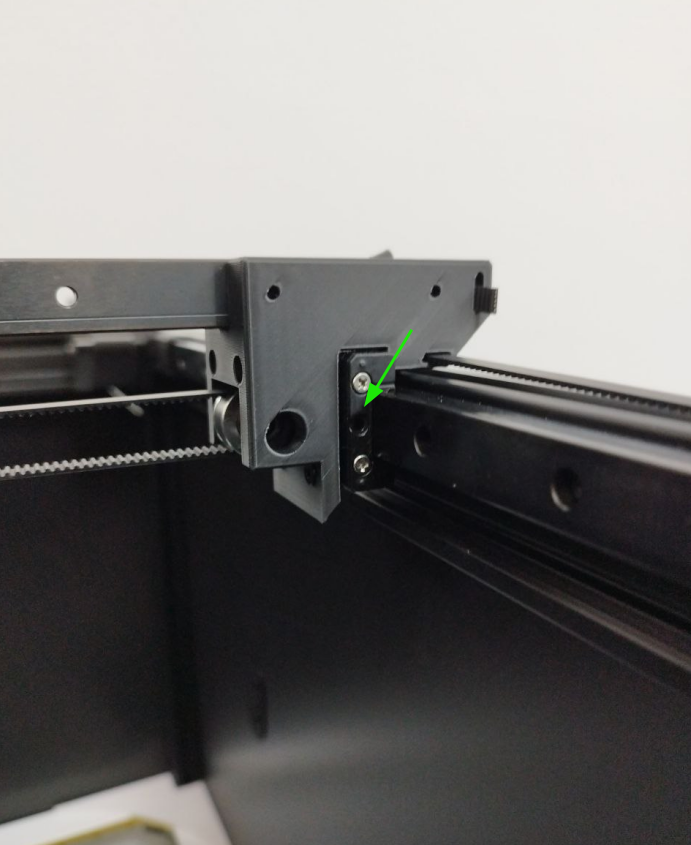

# Maintenance

The **AgnosPCB AI-4050** AOI requires very little maintenance but it is also important for the correct operation of the system.

{width=600px, .center}

| Mainteniance | Periodicity |
| --------- | :-----: |
| [Belts tension adjustment](#belts-tension-check) | Monthly |
| [Cleaning](#cleaning) | Monthly |
| [Rail guide lubrication](#rail-guide-lubrication) | 6 months |

## **Belts tension adjustment**

If you notice excessive belt vibration when the camera moves or the Y-axis carriage is not square to the X-axis, follow the procedure below to tension the belts:

**Step 1**

Pull the end of the belt out of the hole.

{width=400px, .center}

**Step 2**

Loosen the hex screw enough to be able to pull the belt.

{width=400px, .center}

**Step 3**

Pull the belt until it is straight and taut along the entire length of the rails.

{width=400px, .center}

**Step 4**

Tighten the screw to secure the belt in place.

**Step 5**

Insert the end of the belt in the hole

{width=400px, .center}

**Step 6**

Repeat the steps 1 to 5 for the other rail if necesary.

## **Cleaning**

!!! warning "Warning"
    Do not use any liquid cleaner, alcohol or degreaser on moving parts (rails, carriages, spindle, etc...) or electrical components.

**Step 1**

Disconect the power supply or AC cord from the rear panel of the machine.

See red:

{width=400px, .center}

**Step 2**

Use a napkin or cotton swab to remove the old grease from the lineal rails.

{width=400px, .center}

**Step 3**

Use the brush provided in the maintance kit to remove any contamination inside of the rails.

{width=400px, .center}

{width=400px, .center}

**Step 4**

Use the air blower included in the maintenance kit to blow the camera lens and remove any debris.

{width=400px, .center}

!!! note "Note"
    Optionally, you can clean the lens with a microfiber cleaning cloth **after** using the blower, as there may be particles that could scratch the lens.

## **Rail guide lubrication**

!!! warning "Warning"
    Before lubricating the carriages, be sure to [clean](maintenance.md#cleaning) the rails.

**Step 1**

Disconect the power supply or AC cord from the rear panel of the machine.

See red:

{width=400px, .center}

**Step 2**

Insert the end of the grease dispenser provided in the maintance kit into the hole on the side of the rail carriage.

{width=400px, .center}

{width=400px, .center}

**Step 3**

Apply a little grease to the carriage.

{width=400px, .center}

**Step 4**

Move the carts manually to distribute the grease along the rails.

{width=400px, .center}

**Step 5**

Connect the power supply or AC cord to the platform.
