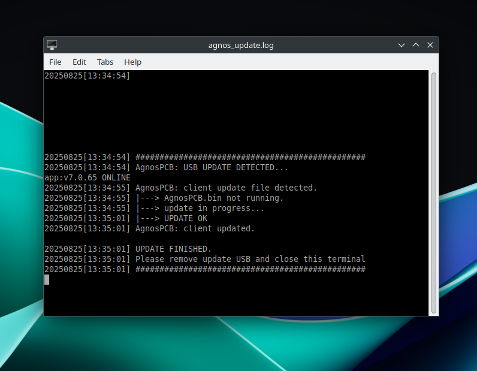

# **Aggiornare il tuo computer AOI**

## Passaggio 1

Scarica il file ZIP fornito dal **team di AgnosPCB**.

## Passaggio 2

Estrai la cartella **AGNOS_UPDATE** (contenuta nel file ZIP) su una chiavetta USB. La chiavetta USB deve essere formattata in **FAT32 o exFAT**. Assicurati che la cartella estratta sulla chiavetta USB si chiami **"AGNOS_UPDATE"** e che si trovi nella cartella radice della chiavetta USB.

## Passaggio 3

Accendi il computer e attendi che appaia il desktop del sistema.

## Passaggio 4

Inserisci la chiavetta USB contenente i file estratti in una porta USB disponibile.

Si aprirà automaticamente una finestra del terminale e il processo di aggiornamento dell'applicazione inizierà. Una volta completato il processo di aggiornamento, rimuovi la chiavetta USB.

