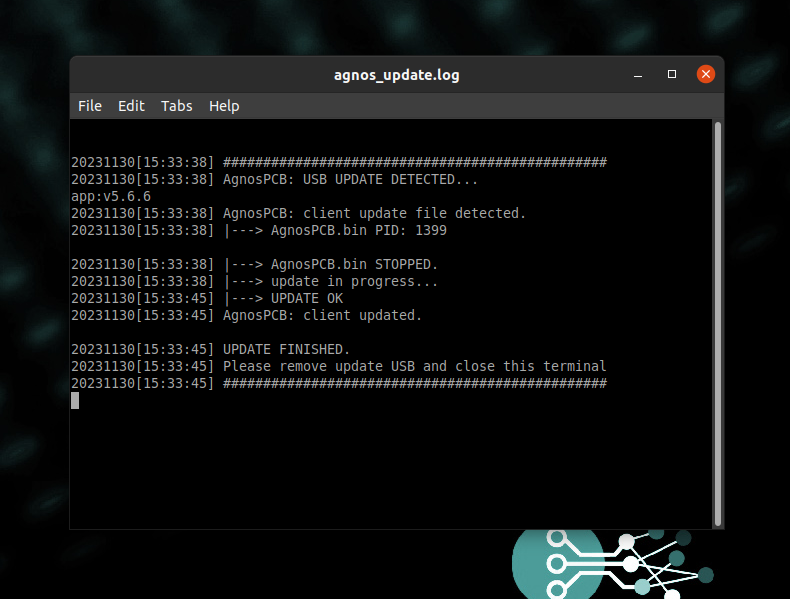

# **Updating your unit**
___

To update your unit (**ONLINE** or **OFFLINE**) follow the steps below:

- Download the ZIP file the AgnosPCB support team provides you.
- Extract the **AGNOS_UPDATE** folder (contained in the ZIP file) onto a USB drive.Ensure that the extracted folder on the USB drive is named **"AGNOS_UPDATE"** and is located in the root directory.
- Power on the computer and wait for the system desktop to appear.
- Insert the USB drive containing the extracted files, into an available USB port.

A terminal window will automatically open, and the application update process will begin.Once the update process is completed, remove the USB drive.

